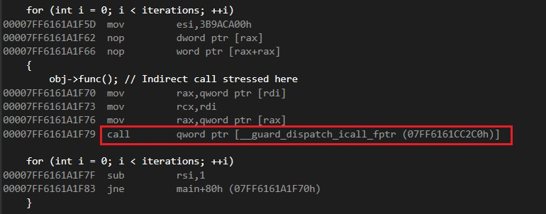

# CFG Overhead



## Introduction
We aim to calculate the overhead of enabling Control Flow Guard (CFG) for a project in Windows. If you are already familiar with CFG in Windows, you can skip this section. Otherwise, you can read more about it in the book "Windows Internals" 7th Edition or other articles like [Exploring Control Flow Guard in Windows 10](http://sjc1-te-ftp.trendmicro.com/assets/wp/exploring-control-flow-guard-in-windows10.pdf).

## Calculation
I was unsure about enabling Control Flow Guard for my project and did not know how much overhead it would incur. Therefore, I decided to create a sample code (with thanks to Deep Seek!) to calculate the overhead.

Here is the code (the code with one billion indirect calls):

```cpp
#include <iostream>
#include <chrono>

// Base class with a virtual function
class Base
{
public:
    virtual void func() = 0;
};

// Derived classes implementing func()
class Derived1 : public Base
{
    volatile int x = 0; // Prevent optimization
public:
    void func() override
    {
        x += 1;
    }
};

class Derived2 : public Base
{
    volatile int y = 0; // Prevent optimization
public:
    void func() override
    {
        y += 2;
    }
};

// Factory function to create objects (prevents devirtualization)
Base* createObject()
{
    volatile int choice = 0; // Volatile to prevent compile-time resolution
    return (choice != 0) ? (Base*)new Derived1() : (Base*)new Derived2();
}

int main()
{
    const int iterations = 1000000000; // Adjust based on system speed
    Base* obj = createObject();

    auto start = std::chrono::high_resolution_clock::now();

    for (int i = 0; i < iterations; ++i)
    {
        obj->func(); // Indirect call stressed here
    }

    auto end = std::chrono::high_resolution_clock::now();
    auto duration = std::chrono::duration_cast<std::chrono::milliseconds>(end - start).count();

    std::cout << "Time taken: " << duration << " ms" << std::endl;

    delete obj;
    return 0;
}
```

I ran the code in **x64-Release** mode on a system with the following specifications:
 - Windows 11
 - RAM: 16GB
 - Processor: Intel Core i5-8400 2.80GHz

With **CFG disabled**, the execution time was approximately **1.4 seconds**. With **CFG enabled**, the execution time increased to approximately **2.4 seconds**.

## Project Configuration
You must enable Control Flow Guard (CFG) both at compile-time and link-time.
 - **Compile Time**: Configuration Properties > C/C++ > Code Generation > Control Flow Guard: **Yes (/guard:cf)**
 - **Link TIme**: Configuration Properties > Linker > Command Line > Additional Options: **/GUARD:CF**

## Important Note
The calculated overhead indicates an overhead of around 70%. However, it is important to note that the entire sample code consists of indirect calls. In your case, a small percentage of your code might be indirect calls, while the majority of your code could be CPU-bound or I/O-bound. Therefore, the overhead of your code would be approximately 70% of the time consumed by indirect calls, relative to the total execution time of the process.

## Linkes
 - https://learn.microsoft.com/en-us/cpp/build/reference/guard-enable-control-flow-guard?view=msvc-170
 - https://learn.microsoft.com/en-us/cpp/build/reference/guard-enable-guard-checks?view=msvc-170
