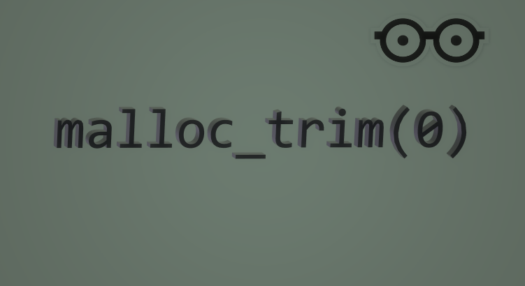

# Glibc Memory Management, Not Your Mem Leak

If it ever happened to you that you wrote a program (especially a very large one) and you tried not to have any memory leak anywhere and did not store any additional data in your containers, or if it was the case, you tried in certain time intervals. Run the cleanup operation in the code you wrote so that no extra memory is allocated to your program. If you have done all these things but you see that your program is eating RAM, you must watch this video. Maybe the problem is somewhere else!

https://youtu.be/Nt7vCxqyaH8

