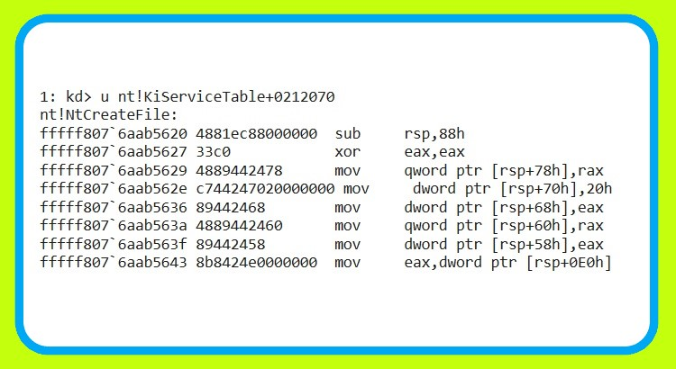

# Life of a WinAPI - from user-mode to kernel-mode



In this post, we are going to review the steps that a Win API goes through from the time it is called to the time it reaches Kernel Mode and its interpretation by the Kernel.

To start, consider the following code snippet (which creates a file using CreateFile, which is a Win API):

```cpp
#include <windows.h>
#include <iostream>

int main ( void ) 
{
    HANDLE hFile = CreateFile ( L "7erom.txt" ,
        GENERIC_WRITE,          // open for writing
        0,                      // do not share
        NULL ,                   // default security
        CREATE_NEW,             // create new file only
        FILE_ATTRIBUTE_NORMAL, // normal file
        NULL ) ;                  // no attr. template
    if ( hFile == INVALID_HANDLE_VALUE ) 
    {
        std::cout << "Unable to open file!" << std::endl;  
        return -1;
    }
    return 0;
}
```

We compile the above code with the name ntdll_test as x86 and x64. In the following, we will examine both cases in the Windows 10 x64 operating system. It is better to announce that the debugger we use is windbg preview (new version of windbg). It is suggested that you use this debugger instead of using the old windbg. You will definitely feel the difference.

## x64 in Windows 10 x64

We run the x64 version of ntdll_test using windbg preview and bu `ntdll_test!mainset` a breakpoint on the main function.

When the program is stopped on the main function, we profile the calls inside the main function using the Trace and Watch Data operation `wt`.

Below, we see an important part of the results of this command:

```
0:000> wt
Tracing ntdll_test!main to return address 00007ff6`f64c2f34
   83     0 [  0] ntdll_test!main
    8     0 [  1]   ntdll_test!main
    1     0 [  2]     KERNEL32!CreateFileW
   20     0 [  2]     KERNELBASE!CreateFileW
   44     0 [  3]       KERNELBASE!CreateFileInternal
   44     0 [  4]         ntdll!RtlInitUnicodeStringEx
   62    44 [  3]       KERNELBASE!CreateFileInternal
   52     0 [  4]         ntdll!RtlDosPathNameToRelativeNtPathName_U_WithStatus
   48     0 [  5]           ntdll!RtlpDosPathNameToRelativeNtPathName
   58     0 [  6]             ntdll!RtlGetFullPathName_Ustr
   88     0 [  7]               ntdll!memset
   65    88 [  6]             ntdll!RtlGetFullPathName_Ustr
    9     0 [  7]               ntdll!RtlpIsDosDeviceName_Ustr
   20     0 [  8]                 ntdll!RtlDetermineDosPathNameType_Ustr
  144    20 [  7]               ntdll!RtlpIsDosDeviceName_Ustr
   69   252 [  6]             ntdll!RtlGetFullPathName_Ustr
   20     0 [  7]               ntdll!RtlDetermineDosPathNameType_Ustr
   93   272 [  6]             ntdll!RtlGetFullPathName_Ustr
   13     0 [  7]               ntdll!RtlpReferenceCurrentDirectory
   10     0 [  8]                 ntdll!RtlEnterCriticalSection
   20    10 [  7]               ntdll!RtlpReferenceCurrentDirectory
   19     0 [  8]                 ntdll!RtlLeaveCriticalSection
   33    29 [  7]               ntdll!RtlpReferenceCurrentDirectory
  105   334 [  6]             ntdll!RtlGetFullPathName_Ustr
    3     0 [  7]               ntdll!RtlpComputeBackupIndex
   25     0 [  8]                 ntdll!RtlDetermineDosPathNameType_Ustr
    8    25 [  7]               ntdll!RtlpComputeBackupIndex
  110   367 [  6]             ntdll!RtlGetFullPathName_Ustr
    9     0 [  7]               ntdll!RtlUnicodeStringCopy
   11     0 [  8]                 ntdll!RtlUnicodeStringValidateDestWorker
   14     0 [  9]                   ntdll!RtlUnicodeStringValidateWorker
   28    14 [  8]                 ntdll!RtlUnicodeStringValidateDestWorker
   17    42 [  7]               ntdll!RtlUnicodeStringCopy
    6     0 [  8]                 ntdll!RtlUnicodeStringValidateSrcWorker
   14     0 [  9]                   ntdll!RtlUnicodeStringValidateWorker
   17    14 [  8]                 ntdll!RtlUnicodeStringValidateSrcWorker
   26    73 [  7]               ntdll!RtlUnicodeStringCopy
  196     0 [  8]                 ntdll!RtlWideCharArrayCopyWorker
   33   269 [  7]               ntdll!RtlUnicodeStringCopy
  547   669 [  6]             ntdll!RtlGetFullPathName_Ustr
    6     0 [  7]               ntdll!_security_check_cookie
  556   675 [  6]             ntdll!RtlGetFullPathName_Ustr
   61  1231 [  5]           ntdll!RtlpDosPathNameToRelativeNtPathName
   25     0 [  6]             ntdll!RtlDetermineDosPathNameType_Ustr
   88  1256 [  5]           ntdll!RtlpDosPathNameToRelativeNtPathName
   22     0 [  6]             ntdll!RtlAllocateHeap
   59     0 [  6]             ntdll!RtlpAllocateHeapInternal
   37     0 [  7]               ntdll!RtlpAllocateHeap
   17     0 [  8]                 ntdll!RtlDebugAllocateHeap
   12     0 [  9]                   ntdll!RtlpCheckHeapSignature
   41    12 [  8]                 ntdll!RtlDebugAllocateHeap
   10     0 [  9]                   ntdll!RtlEnterCriticalSection
   47    22 [  8]                 ntdll!RtlDebugAllocateHeap
   18     0 [  9]                   ntdll!RtlpValidateHeap
   14     0 [ 10]                     ntdll!RtlpValidateHeapHeaders
   37    14 [  9]                   ntdll!RtlpValidateHeap
   51    73 [  8]                 ntdll!RtlDebugAllocateHeap
   22     0 [  9]                   ntdll!RtlAllocateHeap
   59     0 [  9]                   ntdll!RtlpAllocateHeapInternal
  103     0 [ 10]                     ntdll!RtlpAllocateHeap
   10     0 [ 11]                       ntdll!RtlpGetLFHContext
  266    10 [ 10]                     ntdll!RtlpAllocateHeap
   66     0 [ 11]                       ntdll!RtlpHeapRemoveListEntry
  289    76 [ 10]                     ntdll!RtlpAllocateHeap
   70     0 [ 11]                       ntdll!RtlCompareMemoryUlong
  404   146 [ 10]                     ntdll!RtlpAllocateHeap
   16     0 [ 11]                       ntdll!RtlpFindEntry
  122     0 [ 12]                         ntdll!RtlpHeapFindListLookupEntry
   23   122 [ 11]                       ntdll!RtlpFindEntry
  447   291 [ 10]                     ntdll!RtlpAllocateHeap
   43     0 [ 11]                       ntdll!RtlpHeapAddListEntry
  523   334 [ 10]                     ntdll!RtlpAllocateHeap
    7     0 [ 11]                       ntdll!RtlpGetExtraStuffPointer
  562   341 [ 10]                     ntdll!RtlpAllocateHeap
   88   903 [  9]                   ntdll!RtlpAllocateHeapInternal
   56  1086 [  8]                 ntdll!RtlDebugAllocateHeap
   14     0 [  9]                   ntdll!RtlpValidateHeapHeaders
   75  1100 [  8]                 ntdll!RtlDebugAllocateHeap
    7     0 [  9]                   ntdll!RtlpGetExtraStuffPointer
  103  1107 [  8]                 ntdll!RtlDebugAllocateHeap
   19     0 [  9]                   ntdll!RtlLeaveCriticalSection
  113  1126 [  8]                 ntdll!RtlDebugAllocateHeap
   48  1239 [  7]               ntdll!RtlpAllocateHeap
   88  1287 [  6]             ntdll!RtlpAllocateHeapInternal
  114  2653 [  5]           ntdll!RtlpDosPathNameToRelativeNtPathName
   18     0 [  6]             ntdll!memcpy
  146  2671 [  5]           ntdll!RtlpDosPathNameToRelativeNtPathName
   59     0 [  6]             ntdll!memcpy
  177  2730 [  5]           ntdll!RtlpDosPathNameToRelativeNtPathName
   13     0 [  6]             ntdll!RtlpReferenceCurrentDirectory
   10     0 [  7]               ntdll!RtlEnterCriticalSection
   20    10 [  6]             ntdll!RtlpReferenceCurrentDirectory
   19     0 [  7]               ntdll!RtlLeaveCriticalSection
   39    29 [  6]             ntdll!RtlpReferenceCurrentDirectory
  185  2798 [  5]           ntdll!RtlpDosPathNameToRelativeNtPathName
  139     0 [  6]             ntdll!RtlPrefixUnicodeString
  212  2937 [  5]           ntdll!RtlpDosPathNameToRelativeNtPathName
    6     0 [  6]             ntdll!_security_check_cookie
  222  2943 [  5]           ntdll!RtlpDosPathNameToRelativeNtPathName
   54  3165 [  4]         ntdll!RtlDosPathNameToRelativeNtPathName_U_WithStatus
  165  3263 [  3]       KERNELBASE!CreateFileInternal
   48     0 [  4]         ntdll!SbSelectProcedure
   53     0 [  5]           ntdll!memset
   69    53 [  4]         ntdll!SbSelectProcedure
   49     0 [  5]           ntdll!memset
   92   102 [  4]         ntdll!SbSelectProcedure
    6     0 [  5]           ntdll!_security_check_cookie
   99   108 [  4]         ntdll!SbSelectProcedure
  170  3470 [  3]       KERNELBASE!CreateFileInternal
    1     0 [  4]         KERNELBASE!guard_dispatch_icall_nop
    1     0 [  4]         KERNELBASE!AfpAdminDisconnect
  187  3472 [  3]       KERNELBASE!CreateFileInternal
   61     0 [  4]         apphelp!InsHook_NtCreateFile
   99     0 [  5]           apphelp!Insp_ExtensionMatch
    1     0 [  6]             apphelp!wcsnicmp
   48     0 [  6]             ntdll!wcsnicmp
  109    49 [  5]           apphelp!Insp_ExtensionMatch
    1     0 [  6]             apphelp!wcsnicmp
   48     0 [  6]             ntdll!wcsnicmp
  119    98 [  5]           apphelp!Insp_ExtensionMatch
    1     0 [  6]             apphelp!wcsnicmp
   48     0 [  6]             ntdll!wcsnicmp
  129   147 [  5]           apphelp!Insp_ExtensionMatch
    1     0 [  6]             apphelp!wcsnicmp
   48     0 [  6]             ntdll!wcsnicmp
  139   196 [  5]           apphelp!Insp_ExtensionMatch
    1     0 [  6]             apphelp!wcsnicmp
   48     0 [  6]             ntdll!wcsnicmp
  149   245 [  5]           apphelp!Insp_ExtensionMatch
    1     0 [  6]             apphelp!wcsnicmp
   48     0 [  6]             ntdll!wcsnicmp
  159   294 [  5]           apphelp!Insp_ExtensionMatch
    1     0 [  6]             apphelp!wcsnicmp
   48     0 [  6]             ntdll!wcsnicmp
  169   343 [  5]           apphelp!Insp_ExtensionMatch
    1     0 [  6]             apphelp!wcsnicmp
   48     0 [  6]             ntdll!wcsnicmp
  179   392 [  5]           apphelp!Insp_ExtensionMatch
    1     0 [  6]             apphelp!wcsnicmp
   48     0 [  6]             ntdll!wcsnicmp
  190   441 [  5]           apphelp!Insp_ExtensionMatch
   82   631 [  4]         apphelp!InsHook_NtCreateFile
    1     0 [  5]           apphelp!guard_dispatch_icall_nop
    6     0 [  5]           ntdll!NtCreateFile
...
```

As we have seen, first the functions related to file address conversion were called and then the important function `ntdll!NtCreateFile`.

Note: All calls end in the ntdll module. ntdll is the interface between user mode and kernel mode.

Well, now it's time to check `ntdll!NtCreateFile` what's going to happen! Therefore, we will disassemble this function first:

```
0:000> uf ntdll!NtCreateFile
ntdll!NtCreateFile:
00007ff8`040bcb50 4c8bd1          mov     r10,rcx
00007ff8`040bcb53 b855000000      mov     eax,55h
00007ff8`040bcb58 f604250803fe7f01 test    byte ptr [SharedUserData+0x308 (00000000`7ffe0308)],1
00007ff8`040bcb60 7503            jne     ntdll!NtCreateFile+0x15 (00007ff8`040bcb65)  Branch
ntdll!NtCreateFile+0x12:
00007ff8`040bcb62 0f05            syscall
00007ff8`040bcb64 c3              ret
ntdll!NtCreateFile+0x15:
00007ff8`040bcb65 cd2e            int     2Eh
00007ff8`040bcb67 c3              ret</code>
```

In the fourth line, we see the number 55h, which is put into the eax register. What is this number?!

Each function in ntdll has a unique number. This number represents the syscall number of that function. Through this number, Kernel knows what function is called and what routine it should call. We will talk more about the interpretation of this number later.

In the following, we can see that we can tell the cpu that we want to go to Kernel Mode by two ways, sycall and int 2eh, and handle the rest. But the difference between these two instructions (I mean sycall and int 2eh) requires a separate discussion. Let me just say that in older versions of Windows, int 2eh was used and in today's versions, syscall is also added.

We put a bp at the beginning of the ntdll!NtCreateFile function to check the call stack together:

```
0:000> kc
 # Call Site
00 ntdll!NtCreateFile
01 apphelp!InsHook_NtCreateFile
02 KERNELBASE!CreateFileInternal
03 KERNELBASE!CreateFileW
04 ntdll_test!main
05 ntdll_test!invoke_main
06 ntdll_test!__scrt_common_main_seh
07 ntdll_test!__scrt_common_main
08 ntdll_test!mainCRTStartup
09 KERNEL32!BaseThreadInitThunk
0a ntdll!RtlUserThreadStart
```

But what happens in Kernel by calling syscall or int 2eh?

Well, from now on, debugging in user mode will not help us. So we enter kernel mode debugging.

By executing the syscall or int 2eh instruction, we enter the Kernel and execute the System Service Dispatcher operation. During this operation, from a table called System Service Dispatcher Table or SSDT for short, we get the address of the routine that must be executed to perform operations related to ntdll!NtCreateFile. But how?

The value we store in the eax register before executing the syscall or int 2eh instruction is useful here. This value is used as the index of the SSDT table.

We can access the mentioned table through nt!KiServiceTable:

```
11: kd> dd nt!KiServiceTable
fffff807`6a8a35b0  fc7b5904 fc852900 026de402 04538c00
fffff807`6a8a35c0  02a95700 fdb7dc00 027c6f05 02424a06
fffff807`6a8a35d0  027b9605 02407801 02875600 01b1fd00
fffff807`6a8a35e0  01b0fe00 02afce00 02869e00 02a87300
fffff807`6a8a35f0  02230801 027cfc01 02a0ce00 02189002
fffff807`6a8a3600  028bc200 025bcd00 02814301 0281a902
fffff807`6a8a3610  029c5402 01ec8201 01d27901 02751305
fffff807`6a8a3620  01ef4100 019c3003 023b5600 044bd600
```

Each 4 bytes, with the least significant 4 bits removed, represents the address of a routine. For example, in the case of 02751305, by removing the least valuable 4 bits (= value 5), it will be equal to 0275130. But what does this value of 5 show?

The least valuable 4 bits represent the number of input arguments of that routine. In the previous example, the mentioned routine had 5 input arguments. Now with this knowledge, let's go to our work.

Since the value of eax was equal to 0x55, so the index value of the routine is also 0x55. So let's see what the address of the NtCreateFile routine is:

```
1: kd> dd nt!KiServiceTable+55*4 L1
fffff807`6a8a3704  02120707
```

This shows that the address of the function is equal to 0212070. To check, we disassemble this address:

```
1: kd> u nt!KiServiceTable+0212070
nt!NtCreateFile:
fffff807`6aab5620 4881ec88000000  sub     rsp,88h
fffff807`6aab5627 33c0            xor     eax,eax
fffff807`6aab5629 4889442478      mov     qword ptr [rsp+78h],rax
fffff807`6aab562e c744247020000000 mov     dword ptr [rsp+70h],20h
fffff807`6aab5636 89442468        mov     dword ptr [rsp+68h],eax
fffff807`6aab563a 4889442460      mov     qword ptr [rsp+60h],rax
fffff807`6aab563f 89442458        mov     dword ptr [rsp+58h],eax
fffff807`6aab5643 8b8424e0000000  mov     eax,dword ptr [rsp+0E0h]
```


The number 7 also represents the number of input arguments of the routine. But why 7? Is it not that the number of input arguments of the NtCreateFile function is equal to 11:

```
__kernel_entry NTSTATUS NtCreateFile(
  OUT PHANDLE           FileHandle,
  IN ACCESS_MASK        DesiredAccess,
  IN POBJECT_ATTRIBUTES ObjectAttributes,
  OUT PIO_STATUS_BLOCK  IoStatusBlock,
  IN PLARGE_INTEGER     AllocationSize,
  IN ULONG              FileAttributes,
  IN ULONG              ShareAccess,
  IN ULONG              CreateDisposition,
  IN ULONG              CreateOptions,
  IN PVOID              EaBuffer,
  IN ULONG              EaLength
);
```

Don't forget that in 64-bit calls, the first 4 arguments are pushed in the register and the remaining arguments are pushed in the stack. This is also the reason for the increase in numbers.

## x86 in Windows 10 x64 (wow64)

As you know, in a 32-bit operating system, the Kernel is also 32-bit, and in a 64-bit operating system, the Kernel is also 64-bit. But how does an x86 processor work in an x64 kernel? To answer this question, we will proceed with the above example this time for the x86 version of ntdll_test.

In order to run ntdll_test x86 in windbg preview as wow64, follow the following path:

```
File > Launch executable (advanced) > Browse...
Set "Target bitness" --> "Use 64-bit"
```

As in the previous example, we stop from ntdll_test in the main function, but this time, before executing the wt command, we execute the lm command:

```
10:000:x86> lm
start    end        module name
00330000 00352000   ntdll_test C (pdb symbols)          C:\ProgramData\Dbg\sym\ntdll_test.pdb\FEEBEF8A2B32421AAEEDA5640DE8A9AE5\ntdll_test.pdb
608b0000 60a24000   ucrtbased   (deferred)             
60a30000 60ae6000   MSVCP140D   (deferred)             
680a0000 680bb000   VCRUNTIME140D   (deferred)             
711b0000 7124f000   apphelp    (pdb symbols)          C:\ProgramData\Dbg\sym\apphelp.pdb\0D37A746D2E21547F2B11D6457231F8D1\apphelp.pdb
753f0000 754d0000   KERNEL32   (pdb symbols)          C:\ProgramData\Dbg\sym\wkernel32.pdb\7D80824F9CCE7C819044B16FD421C63D1\wkernel32.pdb
757c0000 759be000   KERNELBASE   (pdb symbols)          C:\ProgramData\Dbg\sym\wkernelbase.pdb\B51CE52F863C2F8DF34C736B3D53BDA91\wkernelbase.pdb
77bb0000 77bb9000   wow64cpu   (pdb symbols)          C:\ProgramData\Dbg\sym\wow64cpu.pdb\DEA45E10CDDFECA0DEFADB7905BEC69A1\wow64cpu.pdb
77bc0000 77d5a000   ntdll_77bc0000   (pdb symbols)          C:\ProgramData\Dbg\sym\wntdll.pdb\C426B34E4A17C490B9C8608C500F9F8A1\wntdll.pdb
02270000 022c5000   wow64      (pdb symbols)          C:\ProgramData\Dbg\sym\wow64.pdb\A2E64E5ADC27E0048276806BBEECE2931\wow64.pdb
02c10000 02c8d000   wow64win   (deferred)             
00007ff8`04020000 00007ff8`04210000   ntdll      (pdb symbols)          C:\ProgramData\Dbg\sym\ntdll.pdb\FB60D3E08B5E4960376A4E73BD35F24E1\ntdll.pdb
```

Pay attention to lines 11 and 14. Two ntdlls are loaded. One for 32-bit functions and another for 64-bit functions. With this in mind, we will examine the calls of the main function.

```
0:000:x86> wt
Tracing ntdll_test!main to return address 00342ece
   62     0 [  0] ntdll_test!main
    9     0 [  1]   ntdll_test!main
    1     0 [  2]     KERNEL32!CreateFileW
   28     0 [  2]     KERNELBASE!CreateFileW
   47     0 [  3]       KERNELBASE!CreateFileInternal
   65     0 [  4]         ntdll_77bc0000!RtlInitUnicodeStringEx
   66    65 [  3]       KERNELBASE!CreateFileInternal
    9     0 [  4]         ntdll_77bc0000!RtlDosPathNameToRelativeNtPathName_U_WithStatus
   65     0 [  5]           ntdll_77bc0000!RtlInitUnicodeStringEx
   20    65 [  4]         ntdll_77bc0000!RtlDosPathNameToRelativeNtPathName_U_WithStatus
   45     0 [  5]           ntdll_77bc0000!RtlpDosPathNameToRelativeNtPathName
   71     0 [  6]             ntdll_77bc0000!RtlGetFullPathName_Ustr
  158     0 [  7]               ntdll_77bc0000!memset
   80   158 [  6]             ntdll_77bc0000!RtlGetFullPathName_Ustr
  161     0 [  7]               ntdll_77bc0000!RtlpIsDosDeviceName_Ustr
  119   319 [  6]             ntdll_77bc0000!RtlGetFullPathName_Ustr
   12     0 [  7]               ntdll_77bc0000!RtlpReferenceCurrentDirectory
   16     0 [  8]                 ntdll_77bc0000!RtlEnterCriticalSection
   20    16 [  7]               ntdll_77bc0000!RtlpReferenceCurrentDirectory
   25     0 [  8]                 ntdll_77bc0000!RtlLeaveCriticalSection
   29    41 [  7]               ntdll_77bc0000!RtlpReferenceCurrentDirectory
  133   389 [  6]             ntdll_77bc0000!RtlGetFullPathName_Ustr
    4     0 [  7]               ntdll_77bc0000!RtlpComputeBackupIndex
   34     0 [  8]                 ntdll_77bc0000!RtlDetermineDosPathNameType_Ustr
   10    34 [  7]               ntdll_77bc0000!RtlpComputeBackupIndex
  137   433 [  6]             ntdll_77bc0000!RtlGetFullPathName_Ustr
   17     0 [  7]               ntdll_77bc0000!RtlUnicodeStringCopy
   18     0 [  8]                 ntdll_77bc0000!RtlUnicodeStringValidateDestWorker
   21     0 [  9]                   ntdll_77bc0000!RtlUnicodeStringValidateWorker
   37    21 [  8]                 ntdll_77bc0000!RtlUnicodeStringValidateDestWorker
   28    58 [  7]               ntdll_77bc0000!RtlUnicodeStringCopy
   13     0 [  8]                 ntdll_77bc0000!RtlUnicodeStringValidateSrcWorker
   21     0 [  9]                   ntdll_77bc0000!RtlUnicodeStringValidateWorker
   27    21 [  8]                 ntdll_77bc0000!RtlUnicodeStringValidateSrcWorker
   38   106 [  7]               ntdll_77bc0000!RtlUnicodeStringCopy
  210     0 [  8]                 ntdll_77bc0000!RtlWideCharArrayCopyWorker
   48   316 [  7]               ntdll_77bc0000!RtlUnicodeStringCopy
  519   797 [  6]             ntdll_77bc0000!RtlGetFullPathName_Ustr
   11     0 [  7]               ntdll_77bc0000!RtlGetFullPathName_Ustr
  529   808 [  6]             ntdll_77bc0000!RtlGetFullPathName_Ustr
    3     0 [  7]               ntdll_77bc0000!__security_check_cookie
  532   811 [  6]             ntdll_77bc0000!RtlGetFullPathName_Ustr
  101  1343 [  5]           ntdll_77bc0000!RtlpDosPathNameToRelativeNtPathName
   18     0 [  6]             ntdll_77bc0000!RtlAllocateHeap
   65     0 [  7]               ntdll_77bc0000!RtlpAllocateHeapInternal
   45     0 [  8]                 ntdll_77bc0000!RtlpAllocateHeap
    3     0 [  9]                   ntdll_77bc0000!RtlDebugAllocateHeap
   21     0 [ 10]                     ntdll_77bc0000!_SEH_prolog4
   16    21 [  9]                   ntdll_77bc0000!RtlDebugAllocateHeap
   13     0 [ 10]                     ntdll_77bc0000!RtlpCheckHeapSignature
   43    34 [  9]                   ntdll_77bc0000!RtlDebugAllocateHeap
   16     0 [ 10]                     ntdll_77bc0000!RtlEnterCriticalSection
   50    50 [  9]                   ntdll_77bc0000!RtlDebugAllocateHeap
   15     0 [ 10]                     ntdll_77bc0000!RtlpValidateHeap
   16     0 [ 11]                       ntdll_77bc0000!RtlpValidateHeapHeaders
   30    16 [ 10]                     ntdll_77bc0000!RtlpValidateHeap
   54    96 [  9]                   ntdll_77bc0000!RtlDebugAllocateHeap
   18     0 [ 10]                     ntdll_77bc0000!RtlAllocateHeap
   65     0 [ 11]                       ntdll_77bc0000!RtlpAllocateHeapInternal
  274     0 [ 12]                         ntdll_77bc0000!RtlpAllocateHeap
   76     0 [ 13]                           ntdll_77bc0000!RtlpHeapRemoveListEntry
  299    76 [ 12]                         ntdll_77bc0000!RtlpAllocateHeap
   32     0 [ 13]                           ntdll_77bc0000!RtlCompareMemoryUlong
  360   108 [ 12]                         ntdll_77bc0000!RtlpAllocateHeap
   24     0 [ 13]                           ntdll_77bc0000!RtlFillMemoryUlong
  398   132 [ 12]                         ntdll_77bc0000!RtlpAllocateHeap
    3     0 [ 13]                           ntdll_77bc0000!RtlpAllocateHeap
  416   135 [ 12]                         ntdll_77bc0000!RtlpAllocateHeap
   92   551 [ 11]                       ntdll_77bc0000!RtlpAllocateHeapInternal
   22   643 [ 10]                     ntdll_77bc0000!RtlAllocateHeap
   59   761 [  9]                   ntdll_77bc0000!RtlDebugAllocateHeap
   16     0 [ 10]                     ntdll_77bc0000!RtlpValidateHeapHeaders
   79   777 [  9]                   ntdll_77bc0000!RtlDebugAllocateHeap
    6     0 [ 10]                     ntdll_77bc0000!RtlpGetExtraStuffPointer
  110   783 [  9]                   ntdll_77bc0000!RtlDebugAllocateHeap
    5     0 [ 10]                     ntdll_77bc0000!RtlDebugAllocateHeap
   25     0 [ 11]                       ntdll_77bc0000!RtlLeaveCriticalSection
    6    25 [ 10]                     ntdll_77bc0000!RtlDebugAllocateHeap
  119   814 [  9]                   ntdll_77bc0000!RtlDebugAllocateHeap
   54   933 [  8]                 ntdll_77bc0000!RtlpAllocateHeap
   92   987 [  7]               ntdll_77bc0000!RtlpAllocateHeapInternal
   22  1079 [  6]             ntdll_77bc0000!RtlAllocateHeap
  131  2444 [  5]           ntdll_77bc0000!RtlpDosPathNameToRelativeNtPathName
   32     0 [  6]             ntdll_77bc0000!memmove
  169  2476 [  5]           ntdll_77bc0000!RtlpDosPathNameToRelativeNtPathName
   44     0 [  6]             ntdll_77bc0000!memmove
  206  2520 [  5]           ntdll_77bc0000!RtlpDosPathNameToRelativeNtPathName
   12     0 [  6]             ntdll_77bc0000!RtlpReferenceCurrentDirectory
   16     0 [  7]               ntdll_77bc0000!RtlEnterCriticalSection
   20    16 [  6]             ntdll_77bc0000!RtlpReferenceCurrentDirectory
   25     0 [  7]               ntdll_77bc0000!RtlLeaveCriticalSection
   35    41 [  6]             ntdll_77bc0000!RtlpReferenceCurrentDirectory
  216  2596 [  5]           ntdll_77bc0000!RtlpDosPathNameToRelativeNtPathName
  171     0 [  6]             ntdll_77bc0000!RtlPrefixUnicodeString
  252  2767 [  5]           ntdll_77bc0000!RtlpDosPathNameToRelativeNtPathName
    3     0 [  6]             ntdll_77bc0000!__security_check_cookie
  255  2770 [  5]           ntdll_77bc0000!RtlpDosPathNameToRelativeNtPathName
   22  3090 [  4]         ntdll_77bc0000!RtlDosPathNameToRelativeNtPathName_U_WithStatus
  168  3177 [  3]       KERNELBASE!CreateFileInternal
   50     0 [  4]         ntdll_77bc0000!SbSelectProcedure
   60     0 [  5]           ntdll_77bc0000!memset
   60    60 [  4]         ntdll_77bc0000!SbSelectProcedure
   34     0 [  5]           ntdll_77bc0000!SbObtainTraceHandle
   69    94 [  4]         ntdll_77bc0000!SbSelectProcedure
   56     0 [  5]           ntdll_77bc0000!memset
   95   150 [  4]         ntdll_77bc0000!SbSelectProcedure
    3     0 [  5]           ntdll_77bc0000!__security_check_cookie
   98   153 [  4]         ntdll_77bc0000!SbSelectProcedure
  175  3428 [  3]       KERNELBASE!CreateFileInternal
    1     0 [  4]         KERNELBASE!CDPPreShutdown
  176  3429 [  3]       KERNELBASE!CreateFileInternal
    1     0 [  4]         KERNELBASE!AfpAdminDisconnect
  198  3430 [  3]       KERNELBASE!CreateFileInternal
   64     0 [  4]         apphelp!InsHook_NtCreateFile
  116     0 [  5]           apphelp!Insp_ExtensionMatch
    1     0 [  6]             apphelp!_wcsnicmp
   62     0 [  6]             ntdll_77bc0000!_wcsnicmp
  126    63 [  5]           apphelp!Insp_ExtensionMatch
    1     0 [  6]             apphelp!_wcsnicmp
   62     0 [  6]             ntdll_77bc0000!_wcsnicmp
  136   126 [  5]           apphelp!Insp_ExtensionMatch
    1     0 [  6]             apphelp!_wcsnicmp
   62     0 [  6]             ntdll_77bc0000!_wcsnicmp
  146   189 [  5]           apphelp!Insp_ExtensionMatch
    1     0 [  6]             apphelp!_wcsnicmp
   62     0 [  6]             ntdll_77bc0000!_wcsnicmp
  156   252 [  5]           apphelp!Insp_ExtensionMatch
    1     0 [  6]             apphelp!_wcsnicmp
   62     0 [  6]             ntdll_77bc0000!_wcsnicmp
  166   315 [  5]           apphelp!Insp_ExtensionMatch
    1     0 [  6]             apphelp!_wcsnicmp
   62     0 [  6]             ntdll_77bc0000!_wcsnicmp
  176   378 [  5]           apphelp!Insp_ExtensionMatch
    1     0 [  6]             apphelp!_wcsnicmp
   62     0 [  6]             ntdll_77bc0000!_wcsnicmp
  186   441 [  5]           apphelp!Insp_ExtensionMatch
    1     0 [  6]             apphelp!_wcsnicmp
   62     0 [  6]             ntdll_77bc0000!_wcsnicmp
  196   504 [  5]           apphelp!Insp_ExtensionMatch
    1     0 [  6]             apphelp!_wcsnicmp
   62     0 [  6]             ntdll_77bc0000!_wcsnicmp
  207   567 [  5]           apphelp!Insp_ExtensionMatch
   82   774 [  4]         apphelp!InsHook_NtCreateFile
    1     0 [  5]           apphelp!_guard_check_icall_nop
   83   775 [  4]         apphelp!InsHook_NtCreateFile
    3     0 [  5]           ntdll_77bc0000!NtCreateFile
    1     0 [  6]             ntdll_77bc0000!Wow64SystemServiceCall
    2     0 [  6]             wow64cpu!KiFastSystemCall
   13     0 [  6]             wow64cpu!CpupReturnFromSimulatedCode
    3     0 [  6]             wow64cpu!TurboDispatchJumpAddressStart
    3     0 [  6]             wow64cpu!ServiceNoTurbo
   71     0 [  7]               wow64!Wow64SystemServiceEx
   32     0 [  8]                 wow64!whNtCreateFile
   71     0 [  9]                   wow64!Wow64ShallowThunkAllocObjectAttributes32TO64_FNC
   39     0 [ 10]                     wow64!Wow64ShallowThunkAllocSecurityQualityOfService32TO64_FNC
  129    39 [  9]                   wow64!Wow64ShallowThunkAllocObjectAttributes32TO64_FNC
   26     0 [ 10]                     ntdll!RtlAppendUnicodeStringToString
   38     0 [ 11]                       ntdll!memcpy
   42    38 [ 10]                     ntdll!RtlAppendUnicodeStringToString
  134   119 [  9]                   wow64!Wow64ShallowThunkAllocObjectAttributes32TO64_FNC
   26     0 [ 10]                     ntdll!RtlAppendUnicodeStringToString
   34     0 [ 11]                       ntdll!memcpy
   40    34 [ 10]                     ntdll!RtlAppendUnicodeStringToString
  171   193 [  9]                   wow64!Wow64ShallowThunkAllocObjectAttributes32TO64_FNC
   33     0 [ 10]                     wow64!RedirectPath
  103     0 [ 11]                       ntdll!RtlPrefixUnicodeString
   52   103 [ 10]                     wow64!RedirectPath
   42     0 [ 11]                       ntdll!RtlPrefixUnicodeString
    6     0 [ 12]                         ntdll!NLS_UPCASE
   45     6 [ 11]                       ntdll!RtlPrefixUnicodeString
    6     0 [ 12]                         ntdll!NLS_UPCASE
   51    12 [ 11]                       ntdll!RtlPrefixUnicodeString
   62   166 [ 10]                     wow64!RedirectPath
   11     0 [ 11]                       ntdll!RtlEqualUnicodeString
   68   177 [ 10]                     wow64!RedirectPath
   24     0 [ 11]                       ntdll!RtlPrefixUnicodeString
    6     0 [ 12]                         ntdll!NLS_UPCASE
   27     6 [ 11]                       ntdll!RtlPrefixUnicodeString
    6     0 [ 12]                         ntdll!NLS_UPCASE
   33    12 [ 11]                       ntdll!RtlPrefixUnicodeString
   80   222 [ 10]                     wow64!RedirectPath
   73     0 [ 11]                       ntdll!RtlPrefixUnicodeString
  109   295 [ 10]                     wow64!RedirectPath
   24     0 [ 11]                       ntdll!RtlPrefixUnicodeString
    4     0 [ 12]                         ntdll!NLS_UPCASE
   27     4 [ 11]                       ntdll!RtlPrefixUnicodeString
    6     0 [ 12]                         ntdll!NLS_UPCASE
   33    10 [ 11]                       ntdll!RtlPrefixUnicodeString
  122   338 [ 10]                     wow64!RedirectPath
   24     0 [ 11]                       ntdll!RtlPrefixUnicodeString
    4     0 [ 12]                         ntdll!NLS_UPCASE
   27     4 [ 11]                       ntdll!RtlPrefixUnicodeString
    6     0 [ 12]                         ntdll!NLS_UPCASE
   33    10 [ 11]                       ntdll!RtlPrefixUnicodeString
  135   381 [ 10]                     wow64!RedirectPath
   10     0 [ 11]                       ntdll!RtlPrefixUnicodeString
  148   391 [ 10]                     wow64!RedirectPath
   10     0 [ 11]                       ntdll!RtlPrefixUnicodeString
  161   401 [ 10]                     wow64!RedirectPath
   10     0 [ 11]                       ntdll!RtlPrefixUnicodeString
  174   411 [ 10]                     wow64!RedirectPath
   24     0 [ 11]                       ntdll!RtlPrefixUnicodeString
    4     0 [ 12]                         ntdll!NLS_UPCASE
   27     4 [ 11]                       ntdll!RtlPrefixUnicodeString
    6     0 [ 12]                         ntdll!NLS_UPCASE
   33    10 [ 11]                       ntdll!RtlPrefixUnicodeString
  187   454 [ 10]                     wow64!RedirectPath
   24     0 [ 11]                       ntdll!RtlPrefixUnicodeString
    4     0 [ 12]                         ntdll!NLS_UPCASE
   27     4 [ 11]                       ntdll!RtlPrefixUnicodeString
    6     0 [ 12]                         ntdll!NLS_UPCASE
   33    10 [ 11]                       ntdll!RtlPrefixUnicodeString
  207   497 [ 10]                     wow64!RedirectPath
   26     0 [ 11]                       ntdll!RtlAppendUnicodeStringToString
   49     0 [ 12]                         ntdll!memcpy
   42    49 [ 11]                       ntdll!RtlAppendUnicodeStringToString
  210   588 [ 10]                     wow64!RedirectPath
   26     0 [ 11]                       ntdll!RtlAppendUnicodeStringToString
   34     0 [ 12]                         ntdll!memcpy
   42    34 [ 11]                       ntdll!RtlAppendUnicodeStringToString
  213   664 [ 10]                     wow64!RedirectPath
   26     0 [ 11]                       ntdll!RtlAppendUnicodeStringToString
   44     0 [ 12]                         ntdll!memcpy
   42    44 [ 11]                       ntdll!RtlAppendUnicodeStringToString
  222   750 [ 10]                     wow64!RedirectPath
    6     0 [ 11]                       wow64!_security_check_cookie
  232   756 [ 10]                     wow64!RedirectPath
  180  1181 [  9]                   wow64!Wow64ShallowThunkAllocObjectAttributes32TO64_FNC
   15     0 [ 10]                     wow64!Wow64LogPrint
    6     0 [ 11]                       wow64!_security_check_cookie
   17     6 [ 10]                     wow64!Wow64LogPrint
  186  1204 [  9]                   wow64!Wow64ShallowThunkAllocObjectAttributes32TO64_FNC
    6     0 [ 10]                     wow64!_security_check_cookie
  195  1210 [  9]                   wow64!Wow64ShallowThunkAllocObjectAttributes32TO64_FNC
   59  1405 [  8]                 wow64!whNtCreateFile
    6     0 [  9]                   ntdll!NtCreateFile
```

As you can see in the picture, from the time of calling CreateFile to reaching ntdll!NtCreateFile, a long path has been traveled. That's why we put it on a bp. By running the program and reaching this function and disassembling it, we see something strange `ntdll_77bc0000!NtCreateFile`:

```
0:000:x86> uf ntdll_77bc0000!NtCreateFile
ntdll_77bc0000!NtCreateFile:
77c322c0 b855000000      mov     eax,55h
77c322c5 ba408dc477      mov     edx,offset ntdll_77bc0000!Wow64SystemServiceCall (77c48d40)
77c322ca ffd2            call    edx
77c322cc c22c00          ret     2Ch
```


We don't see any trace of syscall or int 2eh! So where does this happen?

If you remember, we said that the kernel of a 64-bit operating system is naturally 64-bit, so it cannot handle 32-bit calls. (Again) So we need to convert a 32-bit call to a 64-bit call.

If we go back to the result of the instructions of the ntdll_77bc0000!NtCreateFile function, in line 5, we have a call to the function `ntdll_77bc0000!Wow64SystemServiceCall`.

By hitting `t` several times, we go into this call to see its command:

```
0:000:x86> t
ntdll_77bc0000!Wow64SystemServiceCall:
77c48d40 ff252812ce77    jmp     dword ptr [ntdll_77bc0000!Wow64Transition (77ce1228)] ds:002b:77ce1228={wow64cpu!KiFastSystemCall (77bb6000)}
```


It seems that the process of converting a 32-bit call to a 64-bit call is starting from here.

If we do this jmp, we enter another dll named wow64cpu. We have three modules with similar names:

* wow64.dll is responsible for translating *Nt system calls (ntoskrnl.exe / ntdll.dll).
* wow64win.dll is responsible for translating *NtGdi and *NtUser system calls and other GUI related system calls (win32k.sys / win32u.dll).
* wow64cpu.dll is responsible for supporting the execution of 32-bit processes on a 64-bit operating system.
Do not confuse these three things.

By hitting `t`, we continue the execution:

```
0:000:x86> t
wow64cpu!KiFastSystemCall:
77bb6000 ea0960bb773300  jmp     0033:77BB6009
```

Welcome to **"Heaven's Gate"**!

Heaven's Gate is where we migrate from 32-bit to 64-bit during a jmp. And of course a lovely gateway for malware!

Let's move on, now the question arises as to how the address of this jmp is determined at all?

To answer this question, we need to check TEB.

```
0:000:x86> !teb
Wow64 TEB32 at 00dc2000
    ExceptionList:        00f3f8ec
    StackBase:            00f40000
    StackLimit:           00f3d000
    SubSystemTib:         00000000
    FiberData:            00001e00
    ArbitraryUserPointer: 00000000
    Self:                 00dc2000
    EnvironmentPointer:   00000000
    ClientId:             00000ebc . 00003f9c
    RpcHandle:            00000000
    Tls Storage:          00dc202c
    PEB Address:          00dbf000
    LastErrorValue:       0
    LastStatusValue:      c0000034
    Count Owned Locks:    0
    HardErrorMode:        0
Wow64 TEB at 00dc0000
    ExceptionList:        00dc2000
    StackBase:            00e3fd20
    StackLimit:           00e38000
    SubSystemTib:         00000000
    FiberData:            00001e00
    ArbitraryUserPointer: 00000000
    Self:                 00dc0000
    EnvironmentPointer:   00000000
    ClientId:             00000ebc . 00003f9c
    RpcHandle:            00000000
    Tls Storage:          00000000
    PEB Address:          00dbe000
    LastErrorValue:       0
    LastStatusValue:      0
    Count Owned Locks:    0
    HardErrorMode:        0
```

If we check Wow64 TEB32 we have:

```
0:000:x86> dt _teb 00dc2000
ntdll_77bc0000!_TEB
   +0x000 NtTib            : _NT_TIB
   +0x01c EnvironmentPointer : (null) 
   +0x020 ClientId         : _CLIENT_ID
   +0x028 ActiveRpcHandle  : (null) 
   +0x02c ThreadLocalStoragePointer : 0x00dc202c Void
   +0x030 ProcessEnvironmentBlock : 0x00dbf000 _PEB
   +0x034 LastErrorValue   : 0
   +0x038 CountOfOwnedCriticalSections : 0
   +0x03c CsrClientThread  : (null) 
   +0x040 Win32ThreadInfo  : (null) 
   +0x044 User32Reserved   : [26] 0
   +0x0ac UserReserved     : [5] 0
   +0x0c0 WOW32Reserved    : 0x77bb6000 Void
   +0x0c4 CurrentLocale    : 0x409
   +0x0c8 FpSoftwareStatusRegister : 0
   +0x0cc ReservedForDebuggerInstrumentation : [16] (null) 
   +0x10c SystemReserved1  : [26] (null) 
   +0x174 PlaceholderCompatibilityMode : 0 ''
   +0x175 PlaceholderHydrationAlwaysExplicit : 0 ''
   +0x176 PlaceholderReserved : [10]  ""
   +0x180 ProxiedProcessId : 0
   +0x184 _ActivationStack : _ACTIVATION_CONTEXT_STACK
   +0x19c WorkingOnBehalfTicket : [8]  ""
   +0x1a4 ExceptionCode    : 0n0
   +0x1a8 ActivationContextStackPointer : 0x00dc2184 _ACTIVATION_CONTEXT_STACK
   +0x1ac InstrumentationCallbackSp : 0
   +0x1b0 InstrumentationCallbackPreviousPc : 0
   +0x1b4 InstrumentationCallbackPreviousSp : 0
   +0x1b8 InstrumentationCallbackDisabled : 0 ''
   +0x1b9 SpareBytes       : [23]  ""
   +0x1d0 TxFsContext      : 0xfffe
   +0x1d4 GdiTebBatch      : _GDI_TEB_BATCH
   +0x6b4 RealClientId     : _CLIENT_ID
   +0x6bc GdiCachedProcessHandle : (null) 
   +0x6c0 GdiClientPID     : 0
   +0x6c4 GdiClientTID     : 0
   +0x6c8 GdiThreadLocalInfo : (null) 
   +0x6cc Win32ClientInfo  : [62] 0
   +0x7c4 glDispatchTable  : [233] (null) 
   +0xb68 glReserved1      : [29] 0
   +0xbdc glReserved2      : (null) 
   +0xbe0 glSectionInfo    : (null) 
   +0xbe4 glSection        : (null) 
   +0xbe8 glTable          : (null) 
   +0xbec glCurrentRC      : (null) 
   +0xbf0 glContext        : (null) 
   +0xbf4 LastStatusValue  : 0xc0000034
   +0xbf8 StaticUnicodeString : _UNICODE_STRING ""
   +0xc00 StaticUnicodeBuffer : [261]  ""
   +0xe0c DeallocationStack : 0x00e40000 Void
   +0xe10 TlsSlots         : [64] (null) 
   +0xf10 TlsLinks         : _LIST_ENTRY [ 0x0 - 0x0 ]
   +0xf18 Vdm              : (null) 
   +0xf1c ReservedForNtRpc : (null) 
   +0xf20 DbgSsReserved    : [2] (null) 
   +0xf28 HardErrorMode    : 0
   +0xf2c Instrumentation  : [9] (null) 
   +0xf50 ActivityId       : _GUID {00000000-0000-0000-0000-000000000000}
   +0xf60 SubProcessTag    : (null) 
   +0xf64 PerflibData      : (null) 
   +0xf68 EtwTraceData     : (null) 
   +0xf6c WinSockData      : (null) 
   +0xf70 GdiBatchCount    : 0xdc0000
   +0xf74 CurrentIdealProcessor : _PROCESSOR_NUMBER
   +0xf74 IdealProcessorValue : 0x2020000
   +0xf74 ReservedPad0     : 0 ''
   +0xf75 ReservedPad1     : 0 ''
   +0xf76 ReservedPad2     : 0x2 ''
   +0xf77 IdealProcessor   : 0x2 ''
   +0xf78 GuaranteedStackBytes : 0
   +0xf7c ReservedForPerf  : (null) 
   +0xf80 ReservedForOle   : (null) 
   +0xf84 WaitingOnLoaderLock : 0
   +0xf88 SavedPriorityState : (null) 
   +0xf8c ReservedForCodeCoverage : 0
   +0xf90 ThreadPoolData   : (null) 
   +0xf94 TlsExpansionSlots : (null) 
   +0xf98 MuiGeneration    : 0
   +0xf9c IsImpersonating  : 0
   +0xfa0 NlsCache         : (null) 
   +0xfa4 pShimData        : (null) 
   +0xfa8 HeapData         : 0
   +0xfac CurrentTransactionHandle : (null) 
   +0xfb0 ActiveFrame      : (null) 
   +0xfb4 FlsData          : 0x0128a498 Void
   +0xfb8 PreferredLanguages : (null) 
   +0xfbc UserPrefLanguages : 0x012870e8 Void
   +0xfc0 MergedPrefLanguages : 0x012898a8 Void
   +0xfc4 MuiImpersonation : 0
   +0xfc8 CrossTebFlags    : 0
   +0xfc8 SpareCrossTebBits : 0y0000000000000000 (0)
   +0xfca SameTebFlags     : 0x620
   +0xfca SafeThunkCall    : 0y0
   +0xfca InDebugPrint     : 0y0
   +0xfca HasFiberData     : 0y0
   +0xfca SkipThreadAttach : 0y0
   +0xfca WerInShipAssertCode : 0y0
   +0xfca RanProcessInit   : 0y1
   +0xfca ClonedThread     : 0y0
   +0xfca SuppressDebugMsg : 0y0
   +0xfca DisableUserStackWalk : 0y0
   +0xfca RtlExceptionAttached : 0y1
   +0xfca InitialThread    : 0y1
   +0xfca SessionAware     : 0y0
   +0xfca LoadOwner        : 0y0
   +0xfca LoaderWorker     : 0y0
   +0xfca SkipLoaderInit   : 0y0
   +0xfca SpareSameTebBits : 0y0
   +0xfcc TxnScopeEnterCallback : (null) 
   +0xfd0 TxnScopeExitCallback : (null) 
   +0xfd4 TxnScopeContext  : (null) 
   +0xfd8 LockCount        : 0
   +0xfdc WowTebOffset     : 0n-8192
   +0xfe0 ResourceRetValue : 0x01287510 Void
   +0xfe4 ReservedForWdf   : (null) 
   +0xfe8 ReservedForCrt   : 0
   +0xff0 EffectiveContainerId : _GUID {00000000-0000-0000-0000-000000000000}
```


At offset C0, the WOW32Reserved parameter points to address 0x77bb6000. This address keeps the said instruction in itself. To be sure, let's see each other again:


```
0:000:x86> u 0x77bb6000
wow64cpu!KiFastSystemCall:
77bb6000 ea0960bb773300  jmp     0033:77BB6009
77bb6007 0000            add     byte ptr [eax],al
77bb6009 41              inc     ecx
77bb600a ffa7f8000000    jmp     dword ptr [edi+0F8h]
77bb6010 0000            add     byte ptr [eax],al
77bb6012 0000            add     byte ptr [eax],al
77bb6014 0000            add     byte ptr [eax],al
77bb6016 0000            add     byte ptr [eax],al
```

Well, let's go back to the code that was running and go through the gate of heaven by executing the jmp command:


```
wow64cpu!KiFastSystemCall+0x9:
00000000`77bb6009 41ffa7f8000000  jmp     qword ptr [r15+0F8h] ds:00000000`77bb3718={wow64cpu!CpupReturnFromSimulatedCode (00000000`77bb1742)}
```

Pay attention to the address of the instructions! Yes, we have entered the 64-bit world.

Since it takes a long time to trace and reach ntdll!NtCreateFile, by putting bp on this function, we directly enter the 64-bit ntdll.

Stopping at the beginning of this function, we examine its instructions:

```
0:000> u
ntdll!NtCreateFile:
00007ff8`040bcb50 4c8bd1          mov     r10,rcx
00007ff8`040bcb53 b855000000      mov     eax,55h
00007ff8`040bcb58 f604250803fe7f01 test    byte ptr [Sh1aredUserData+0x308 (00000000`7ffe0308)],1
00007ff8`040bcb60 7503            jne     ntdll!NtCreateFile+0x15 (00007ff8`040bcb65)
00007ff8`040bcb62 0f05            syscall
00007ff8`040bcb64 c3              ret
00007ff8`040bcb65 cd2e            int     2Eh
00007ff8`040bcb67 c3              ret
```

We reached the same results as in the 64-bit call analysis in the 64-bit operating system. Now let's look at the list of the last 11 calls before reaching ntdll!NtCreateFile:

```
0:000> kc
 # Call Site
00 ntdll!NtCreateFile
01 wow64!whNtCreateFile
02 wow64!Wow64SystemServiceEx
03 wow64cpu!ServiceNoTurbo
04 wow64cpu!BTCpuSimulate
05 wow64!RunCpuSimulation
06 wow64!Wow64LdrpInitialize
07 ntdll!LdrpInitializeProcess
08 ntdll!_LdrpInitialize
09 ntdll!LdrpInitialize
0a ntdll!LdrInitializeThunk
```

Each of these functions plays a role and I do not want to go into the details of each of these functions. Just as an example, one of the tasks of the function `wow64!whNtCreateFile` (and as such, all functions `*wow64!wh`) is to convert the standard passing of function arguments from 32-bit to 64-bit format. As you know, in 32-bit processes, when calling a function, its arguments are pushed from right to left in the stack, but in 64-bit processes, from right to left, the first four arguments are placed in the registers rcx and rdx, r8 and r9, respectively. The rest of the arguments are pushed on the stack.

