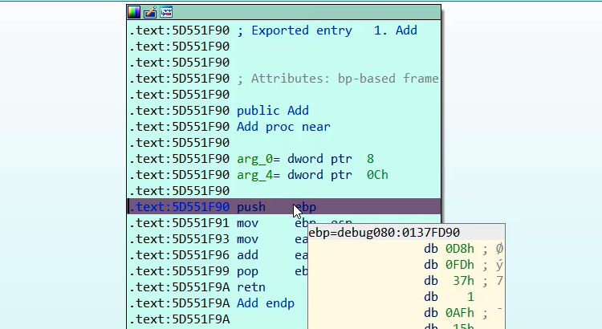

# Reverse a Function of Dll by IDA Pro

A few days ago, one of my friends asked me: “How can I reverse a function of dll?”. I gave him some solutions. Then, I decided to create a short video tutorial.

I created a sample dll (my_dll.dll) and a sample host application to load the dll during reversing operations (my_exe.exe). By IDA Pro, I choose the my_dll.dll and set my_exe.exe as host application.

For more information, view the video tutorial:

https://youtu.be/Jg3YATAb9hs
