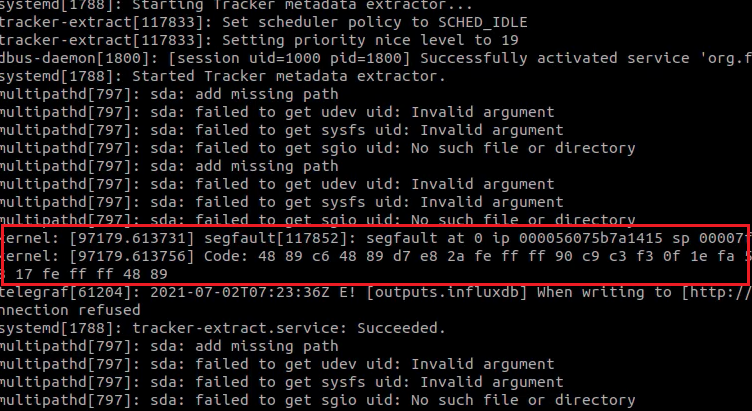

# Understanding Kernel Log for Segfault

If you didn't pay attention to the kernel log when your program gave a segfault, I suggest you watch this video. There may come a day (like my experience) when you don't have access to any method to understand the problem of your program other than analyzing these two log lines.

In this video, I analyzed these two log lines and also gave an example for better understanding.

Thank you for your comments about this and other videos.

https://youtu.be/Nx3JjA6W0uk
