# Verifying Embedded PE Signature

# What Do We Cover?

For a given signed PE file, with the signature embedded, we extract the signature and certificates. These are then parsed using PKCS and ASN.1 standards.

# What We Don't Cover

- PE files whose digital signatures are not embedded (reside in catalog files)
- Validating timestamp of the signatures
- Validating the key usage
- Validating the chain of the certificates
- Using Windows APIs like `WinTrust` to verify signatures
- A full tutorial on ASN.1

# Tools

- CFF Explorer
- signtool
- HxD
- pe bear

# Links
 - Parsing ASN.1: https://pkitools.net/pages/ca/asn1.html
 - Calculating hash from hex sequence: https://emn178.github.io/online-tools/
 - ASN.1 tutorial: https://obj-sys.com/asn1tutorial/asn1only.html
 - ASN.1 and DER tutorial: https://learn.microsoft.com/en-us/windows/win32/seccertenroll/distinguished-encoding-rules
 - ASN.1 and DER tutorial: https://luca.ntop.org/Teaching/Appunti/asn1.html

# Table of Contents

- Parsing PE
- Parsing WIN_CERTIFICATE
- PKCS #n
- Structure of PKCS #7
- Parsing ContentInfo
- Parsing Certificates
- Parsing SignInfo
- Appendix A: Calculating the PE Image Hash
- Appendix B: A Brief Introduction to ASN.1
- Appendix C: Most Important Fields of PKCS7

# Introduction

PE files are digitally signed to verify various aspects, such as identifying the publisher of the file and ensuring the file's integrity has not been compromised. In this write-up, we will not explain why PE files are signed, but we will delve into how they are signed and how we can verify their signatures.

*Note: Please be very patient. This document contains numerous terms with complex relationships, ambiguous names, and involves working with bytes and binary data. Therefore, it may require multiple reviews to fully understand.*

## Digital Signature

We provide a sample in the *sample* directory, which contains a file named *dbgview64.exe*. We perform all verification operations on this sample PE file.

In the properties of this PE file, you can view the *Digital Signatures* tab.

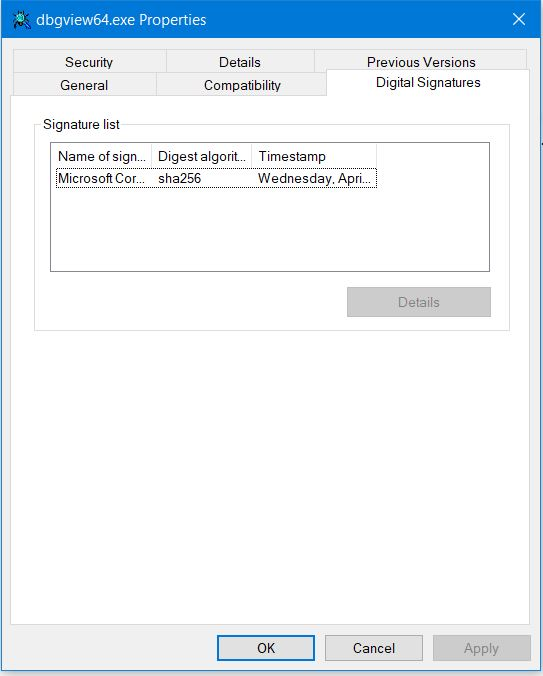

This tab contains almost all the information required for verification. By clicking on *Details*, you can view the signature information.

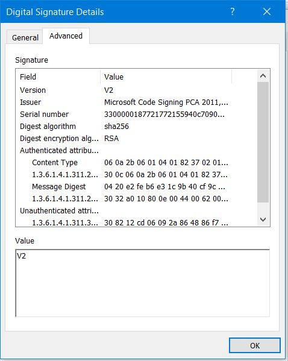

You can see many *fields*—some you may understand, some you may not, and some you might misunderstand. Misunderstand!? Yes, by the end of this write-up, you'll see why!

Next, go to the General tab to view the *certificate* that signed this PE file, as well as the certification hierarchy.

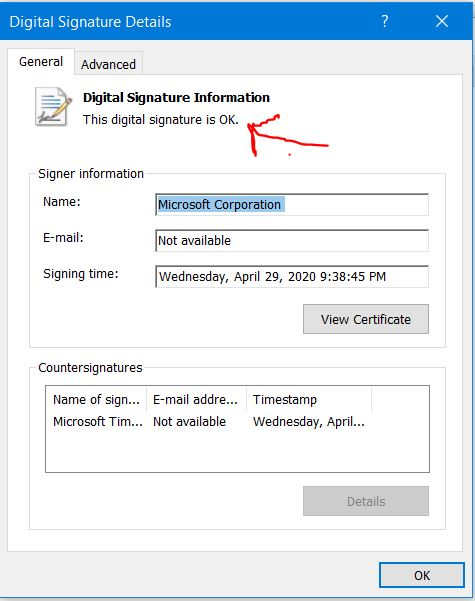

By clicking on *View Certificate* and navigating to the *Details* tab, you can find all the information about the signer's certificate for this PE file.

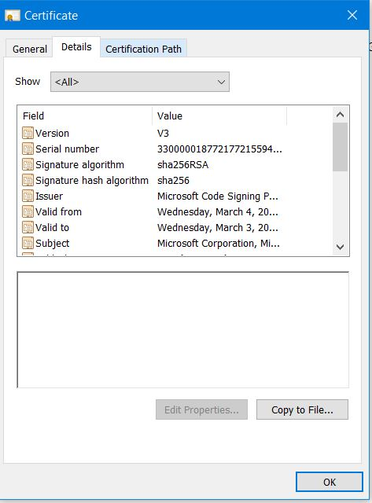

However, some fields are not part of the certificate and can only be viewed in the GUI. Unfortunately (!), one of these is the *Thumbprint*, which is recalculated every time you open this dialog. As a result, we need to calculate it manually, which will be explained later.

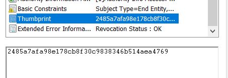

In the *Certification Path* tab, you can see the chain of certifications. To view the details of each certificate, simply click *View Certificate* as you did before.

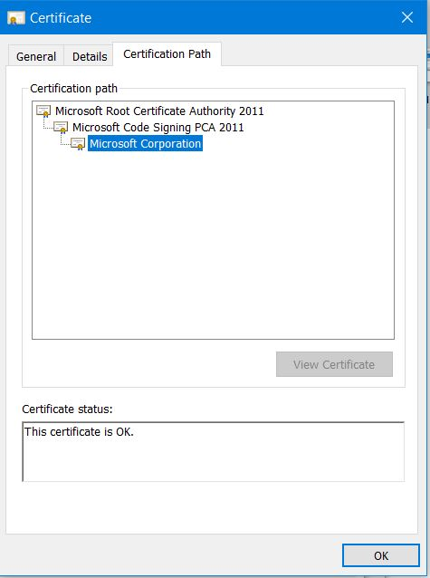

However, for some PE files, such as *C:\Windows\System32\notepad.exe*, the Digital Signatures tab is missing. What does this mean? It indicates that Notepad is not signed!?

Let’s verify this using *signtool.exe*:

```shell
C:\>signtool.exe verify /a /v C:\Windows\System32\notepad.exe

Verifying: C:\Windows\System32\notepad.exe
File is signed in catalog: C:\WINDOWS\system32\CatRoot\{F750E6C3-38EE-11D1-85E5-00C04FC295EE}\Microsoft-Windows-Notepad-FoD-Package~31bf3856ad364e35~amd64~~10.0.19041.4355.cat
Hash of file (sha1): BC43D65CC41670FBB1E1A686AE62BFF3F9AA784A

Signing Certificate Chain:
    Issued to: Microsoft Root Certificate Authority 2010
    Issued by: Microsoft Root Certificate Authority 2010
    Expires:   Sun Jun 24 01:34:01 2035
    SHA1 hash: 3B1EFD3A66EA28B16697394703A72CA340A05BD5

        Issued to: Microsoft Windows Production PCA 2011
        Issued by: Microsoft Root Certificate Authority 2010
        Expires:   Mon Oct 19 22:21:42 2026
        SHA1 hash: 580A6F4CC4E4B669B9EBDC1B2B3E087B80D0678D

            Issued to: Microsoft Windows
            Issued by: Microsoft Windows Production PCA 2011
            Expires:   Thu Nov 14 22:50:08 2024
            SHA1 hash: 71F53A26BB1625E466727183409A30D03D7923DF

The signature is timestamped: Sat Apr 13 19:02:25 2024
Timestamp Verified by:
    Issued to: Microsoft Root Certificate Authority 2010
    Issued by: Microsoft Root Certificate Authority 2010
    Expires:   Sun Jun 24 01:34:01 2035
    SHA1 hash: 3B1EFD3A66EA28B16697394703A72CA340A05BD5

        Issued to: Microsoft Time-Stamp PCA 2010
        Issued by: Microsoft Root Certificate Authority 2010
        Expires:   Mon Sep 30 22:02:25 2030
        SHA1 hash: 36056A5662DCADECF82CC14C8B80EC5E0BCC59A6

            Issued to: Microsoft Time-Stamp Service
            Issued by: Microsoft Time-Stamp PCA 2010
            Expires:   Fri Jan 10 22:37:12 2025
            SHA1 hash: 68A0528ACCB8CBCEA997C5F2DB6089644C44DAF3

Successfully verified: C:\Windows\System32\notepad.exe

Number of files successfully Verified: 1
Number of warnings: 0
Number of errors: 0
```

The signature is verified! But which signature?

Don’t be confused! Windows stores the signatures of some PE files in the *CatRoot* database (located in `C:\Windows\System32`). Many PE files in the System32 folder have their signatures stored in this database. In this write-up, we won’t be discussing catalog files or how to parse them, so any PE files whose signatures are not embedded within the file itself are beyond our scope.

# Parsing PE

Let’s open *dbgview64.exe* using *CFF Explorer*. In the `Optional Header`, there is a data directory named the `Security Directory` (also referred to as the `Certification Table`).


You can also locate the `Security Directory` using *PE Bear* in the `Security` tab.

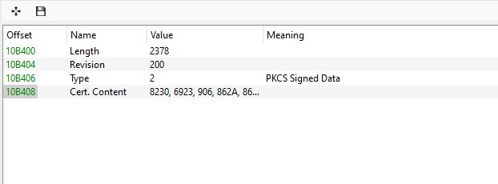

This section indicates where the embedded digital signature is stored and its size. In our sample file, it starts at offset `0x10B400` from the beginning of the file and has a size of `0x2378`.

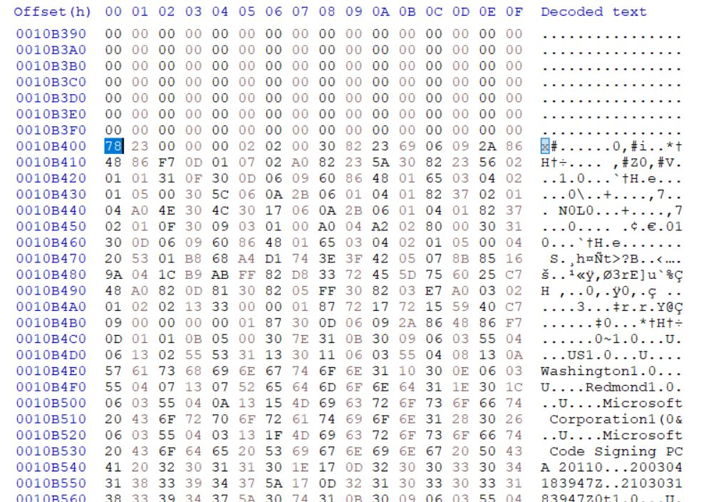

When examining the decoded text, you’ll find recognizable terms like *Microsoft Corporation*, *Redmond*, *Washington*, and others. This suggests we’re in the right place.

But how do we decode these bytes to achieve our goal? To do so, we need to become familiar with the `WIN_CERTIFICATE` structure.

Now it’s time to roll up our sleeves and dive in!

# Parsing WIN_CERTIFICATE

All the bytes in the security directory must be interpreted as a `WIN_CERTIFICATE` structure, defined as follows:

```cpp
typedef struct _WIN_CERTIFICATE {
  DWORD dwLength;
  WORD  wRevision;
  WORD  wCertificateType;
  BYTE  bCertificate[ANYSIZE_ARRAY];
} WIN_CERTIFICATE, *LPWIN_CERTIFICATE;
```

 - **dwLength** (4 bytes): The length of the structure or security directory. In the raw file, this is represented as `23 78 00 00`.
 - **wRevision**: The revision number. This field is not critical for our purposes.
 - **wCertificateType**: This specifies the type of certificate. For our case, the type is `WIN_CERT_TYPE_PKCS_SIGNED_DATA`, so wCertificateType is set to `0x2`.
 - **bCertificate**: This is the key field. While the security directory could potentially contain multiple `bCertificate` entries, for simplicity, we’ll assume there’s only one. The bCertificate field is not a defined structure in itself; it contains another structure called `PKCS7`, which is crucial for digital signatures.

For simplicity, we’ll dump the security directory into a single file named `security_directory.bin` and work with it from there.

# PKCS #n
There are several types of PKCS, each serving a different cryptographic function. Here’s a list of PKCS types, sourced from [Wikipedia](https://en.wikipedia.org/wiki/PKCS):

- PKCS #1: RSA Cryptography Standard
- PKCS #2: *Withdrawn*
- PKCS #3: Diffie–Hellman Key Agreement Standard
- PKCS #4: *Withdrawn*
- PKCS #5: Password-based Encryption Standard
- PKCS #6: Extended-Certificate Syntax Standard
- **PKCS #7: Cryptographic Message Syntax Standard**
- PKCS #8: Private-Key Information Syntax Standard
- PKCS #9: Selected Attribute Types
- PKCS #10: Certification Request Standard
- PKCS #11: Cryptographic Token Interface
- PKCS #12: Personal Information Exchange Syntax Standard
- PKCS #13: Elliptic-curve cryptography Standard
- PKCS #14: Pseudo-random Number Generation
- PKCS #15: Cryptographic Token Information Format Standard

For digital signatures, our primary focus will be on PKCS #7, but we will also touch on PKCS #1, PKCS #9, and PKCS #13 in relation to signature processing.

# Parsing PKCS #7

Let's return to our focus. The bCertificate field consists of a PKCS7 structure. First, we need to familiarize ourselves with its structure. Based on the [RFC](https://datatracker.ietf.org/doc/html/rfc2315#section-9.1), the signed data in PKCS7 format is defined as follows (in ASN.1 syntax):

```ASN.1
ContentInfo ::= SEQUENCE {
    contentType     ContentType,
    content         [0] EXPLICIT ANY DEFINED BY contentType OPTIONAL 
}

ContentType ::= OBJECT IDENTIFIER
```   

> contentType indicates the type of content. It is an object identifier, which means it is a unique string of integers assigned by the authority that defines the content type. This document defines six content types: *data*, *signedData*, *envelopedData*, *signedAndEnvelopedData*, *digestedData*, and *encryptedData*.

We are focusing on *signedData* specifically, so the content of the content field is structured as follows:

```ASN.1
SignedData ::= SEQUENCE {
    version             Version,
    digestAlgorithms    DigestAlgorithmIdentifiers,
    contentInfo         ContentInfo,
    certificates        [0] IMPLICIT   ExtendedCertificatesAndCertificates OPTIONAL,
    crls                [1] IMPLICIT   CertificateRevocationLists OPTIONAL,
    signerInfos         SignerInfos 
}
```

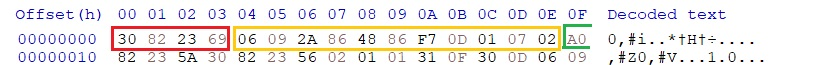

- The first 4 bytes represent the `ContentInfo` field, indicating a *SEQUENCE* containing `0x2369` bytes.
- The yellow box highlights the `contentType` field, which is an OID (Object Identifier) defining the type of the content. 
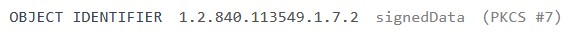
- The unfinished green box represents `content` field, corresponding to the value of `contentType`. Here, it represents signed data. The byte `0xA0` signifies `[0] EXPLICIT`, containing `0x235A` bytes. The following 4 bytes represent `SignedData` structure as a *SEQUENCE* containing `0x2356` bytes.

*Note: For a brief introduction to `ASN.1`, see the appendix.*

At this point, we have parsed up to offset `0x16`, where multiple fields and their types are visible. While there are additional details for each field, we will focus on the essential fields needed to proceed: `contentInfo`, `certificates`, and `signerInfos` within the `SignedData` structure.

## version

 - *INTEGER* 
 - 1 byte
 - offset [`0x16`, `0x19`] 
 
We can disregard this field.

## digestAlgorithms

```ASN.1
DigestAlgorithmIdentifiers ::= SET OF DigestAlgorithmIdentifier
```

 - *SET* 
 - `0x0F` bytes
 - offset [`0x1A`, `0x2A`] 
 
We can disregard this field.

## contentInfo

```ASN.1
ContentInfo ::= SEQUENCE {
    contentType     ContentType,
    content         [0] EXPLICIT ANY DEFINED BY contentType OPTIONAL 
}

ContentType ::= OBJECT IDENTIFIER

SpcIndirectDataContent ::= SEQUENCE {
    data                    SpcAttributeTypeAndOptionalValue,
    messageDigest           DigestInfo
}

SpcAttributeTypeAndOptionalValue ::= SEQUENCE {
    type                    ObjectID,
    value                   [0] EXPLICIT ANY OPTIONAL
}

DigestInfo ::= SEQUENCE {
    digestAlgorithm     AlgorithmIdentifier,
    digest              OCTETSTRING
}

AlgorithmIdentifier    ::=    SEQUENCE {
    algorithm           ObjectID,
    parameters          [0] EXPLICIT ANY OPTIONAL
}
```

 - *SEQUENCE* 
 - `0x5C` bytes
 - offset [`0x2B`, `0x88`] 
 
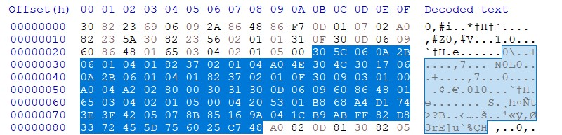

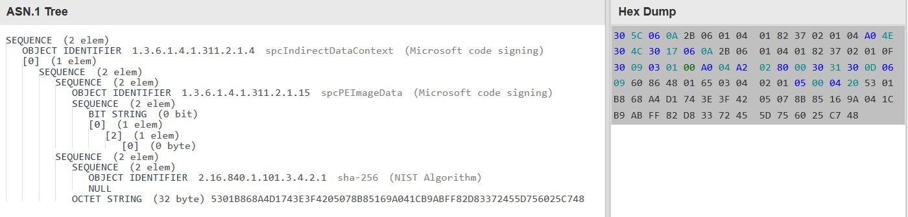

As shown, `ContentInfo` field is a *SEQUENCE* that includes two fields: `contentType` and `content`. Here, the `contentType` is an OID that specifies the content type. The value of this field should be `1.3.6.1.4.1.311.2.1.4`, representing `SpcIndirectDataContent`.

`Content` field starts with `[0] EXPLICIT`, meaning the byte at offset `0x39` is `0xA0`, with a size of `0x4E` bytes.

Now that we know the content type is `SpcIndirectDataContent`, we can see it is a *SEQUENCE* with two fields, `data` and `messageDigest`, spanning `0x4E` bytes from offset `0x3B` to offset `0x88`.

The `SpcIndirectDataContent` structure contains an important field named `messageDigest`, which itself includes `digestAlgorithm` and `digest`.

### digestAlgorithm

`digestAlgorithm` field provides details about the algorithm (and any associated parameters) used to generate the digest.

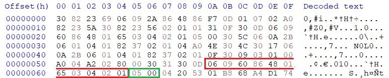

As shown, it specifies the hash algorithm (`sha256`) and parameters (`NULL`).

Below is a list of the most common hash algorithms with their corresponding OIDs and encoded DER representations:

```
MD2 		    {0x2A, 0x86, 0x48, 0x86, 0xF7, 0x0D, 0x02, 0x02}			// 1.2.840.113549.2.2
MD5 		    {0x2A, 0x86, 0x48, 0x86, 0xF7, 0x0D, 0x02, 0x05}			// 1.2.840.113549.2.5
SHA1 		    {0x2B, 0x0E, 0x03, 0x02, 0x1A}	 				// 1.3.14.3.2.26
SHA224 		    {0x60, 0x86, 0x48, 0x01, 0x65, 0x03, 0x04, 0x02, 0x04}		// 2.16.840.1.101.3.4.2.4
SHA256 		    {0x60, 0x86, 0x48, 0x01, 0x65, 0x03, 0x04, 0x02, 0x01} 		// 2.16.840.1.101.3.4.2.1
SHA384 		    {0x60, 0x86, 0x48, 0x01, 0x65, 0x03, 0x04, 0x02, 0x02}		// 2.16.840.1.101.3.4.2.2
SHA512 		    {0x60, 0x86, 0x48, 0x01, 0x65, 0x03, 0x04, 0x02, 0x03}		// 2.16.840.1.101.3.4.2.3
SHA512-224 	    {0x60, 0x86, 0x48, 0x01, 0x65, 0x03, 0x04, 0x02, 0x05}		// 2.16.840.1.101.3.4.2.5
SHA512-256 	    {0x60, 0x86, 0x48, 0x01, 0x65, 0x03, 0x04, 0x02, 0x06}		// 2.16.840.1.101.3.4.2.6
```

*Note: It's important to mention that parameters are not always `NULL`.*

### digest

`digest` field holds the actual hash value of the PE image file, calculated using the hash algorithm specified in the `digestAlgorithm` field. Calculating a PE file’s digest isn’t straightforward! For further details, see the appendix.

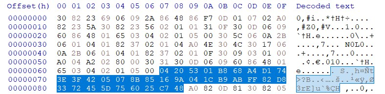

In the image above, the bytes corresponding to `digest` field are highlighted. The first two bytes represent the ASN.1 tag and the digest length, followed by the digest value itself. In our example file, the digest is: `5301B868A4D1743E3F4205078B85169A041CB9ABFF82D83372455D756025C748`

This value represents the digest of the PE image file. However, it’s not directly used as the message to be signed—this is only the first step in creating the final message. Two additional steps are required. To proceed with the second step, refer to the next section.

### Calculating digest of contentInfo 

This is the second (semi-final) step in creating the message to be signed. Revisit the `contentInfo` ASN tree: it consists of a `content` field with the type `SpcAttributeTypeAndOptionalValue`. Using the previously specified hash algorithm, create a digest of `SpcAttributeTypeAndOptionalValue`, excluding the *OPTIONAL* part and omitting the first *SEQUENCE* tag. This means concatenating only the `data` and `messageDigest` fields.

In our example file, this section starts at offset `0x3D` and ends at offset `0x88`.

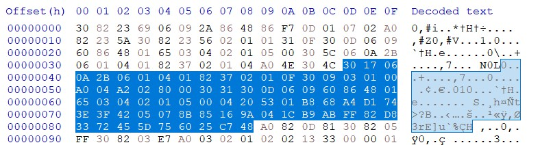

`data`: `3017060A2B06010401823702010F3009030100A004A2028000`

`messageDigest`: `3031300D0609608648016503040201050004205301B868A4D1743E3F4205078B85169A041CB9ABFF82D83372455D756025C748`

The SHA-256 digest of the concatenated `data` and `messageDigest` fields is as follows:

`E2FEB6E31C9B40CF9C326922FFD690CB17ABDEA3E06F27766888CD36F4515785`

You may wonder why `ContentInfo` content is included as part of the message to be signed. This is because it contains the hash algorithm used, in addition to the PE image file hash.

However, we are only on step two—one more step remains. So, stay tuned!

## certificates

This field is a crucial part of the `SignedData` structure, containing all certificates involved in signing the PE file (typically excluding the topmost certificate in the certificate chain). It is structured as a list of certificates, where each certificate is represented as a *SEQUENCE* of ASN.1-encoded values.

According to [RFC](https://datatracker.ietf.org/doc/html/rfc5280#section-4.1), the basic syntax for an X.509 v3 certificate is as follows:

```ASN.1
Certificate  ::=  SEQUENCE  {
    tbsCertificate       TBSCertificate,
    signatureAlgorithm   AlgorithmIdentifier,
    signatureValue       BIT STRING  
}

TBSCertificate  ::=  SEQUENCE  {
    version         [0]  EXPLICIT Version DEFAULT v1,
    serialNumber         CertificateSerialNumber,
    signature            AlgorithmIdentifier,
    issuer               Name,
    validity             Validity,
    subject              Name,
    subjectPublicKeyInfo SubjectPublicKeyInfo,
    issuerUniqueID  [1]  IMPLICIT UniqueIdentifier OPTIONAL,
                            -- If present, version MUST be v2 or v3
    subjectUniqueID [2]  IMPLICIT UniqueIdentifier OPTIONAL,
                            -- If present, version MUST be v2 or v3
    extensions      [3]  EXPLICIT Extensions OPTIONAL
                            -- If present, version MUST be v3
}
```

 - *[0] IMPLICIT* of *SEQUENCE*
 - `0xD81` bytes
 - offset [`0x89`, `0xE0D`] 

In this instance, `certificates` contains two certificates with a combined size of `0xD81`. The first certificate, with a size of `0x5FF`, spans from offset `0x8D` to offset `0x68F`, while the second, with a size of `0x77A`, spans from offset `0x690` to offset `0xE0D`. Keep track of these certificate offsets, as they will be needed for calculating the thumbprint in a later section. For simplicity, we will parse only the first certificate here—try parsing the second as a practice!


The main focus in this section is the `TBSCertificate` field. It contains a *SEQUENCE* of 10 fields: `version`, `serialNumber`, `signature`, `issuer`, `validity`, `subject`, `subjectPublicKeyInfo`, `issuerUniqueID`, `subjectUniqueID` and `extensions`.

### version

```ASN.1
Version  ::=  INTEGER  {  v1(0), v2(1), v3(2)  }
```

 - *[0] IMPLICIT* of *INTEGER*
 - 1 byte
 - offset [`0x95`, `0x99`] 

We can disregard this field.

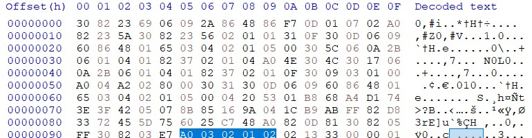

### serialNumber

```ASN.1
CertificateSerialNumber  ::=  INTEGER
```

 - *INTEGER*
 - `0x13` bytes
 - offset [`0x9A`, `0xAE`] 

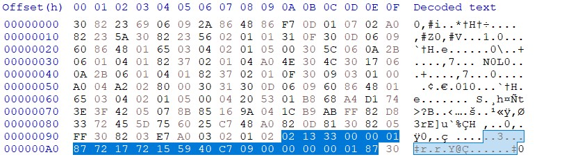

One key field in a certificate is the serial number, which is ideally globally unique but practically “almost” unique. In the X.509 ecosystem, serial numbers are typically generated by combining the issuerDN (Distinguished Name of the issuer) with a unique internal ID from the certificate authority (CA). Although this is the intended practice, it is not always followed consistently.

In upcoming sections, the serial number will help us identify the certificate used to sign the PE file. In this example, the serial number for the first certificate is:

`33 00 00 01 87 72 17 72 15 59 40 C7 09 00 00 00 00 01 87`

### signature

```ASN.1
AlgorithmIdentifier  ::=  SEQUENCE  {
    algorithm               OBJECT IDENTIFIER,
    parameters              ANY DEFINED BY algorithm OPTIONAL  
}
```

 - *SEQUENCE*
 - `0xD` bytes
 - offset [`0xAF`, `0xBD`] 

We can disregard this field.

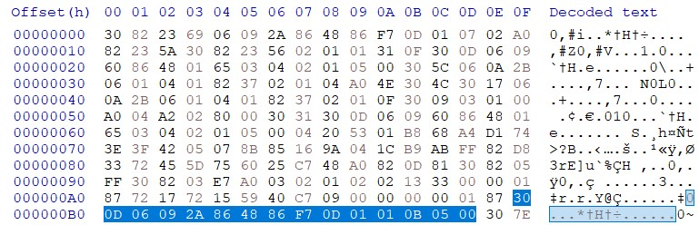

### issuer

 - *SEQUENCE*
 - `0x7E` bytes
 - offset [`0xBE`, `0x13D`] 

We can disregard this field.

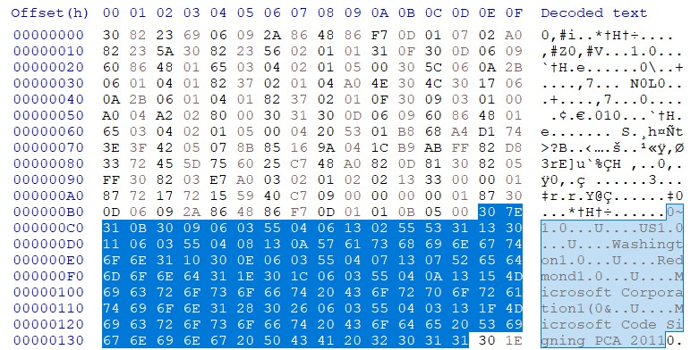

### validity

 - *SEQUENCE*
 - `0x1E` bytes
 - offset [`0x13E`, `0x15D`] 

We can disregard this field.

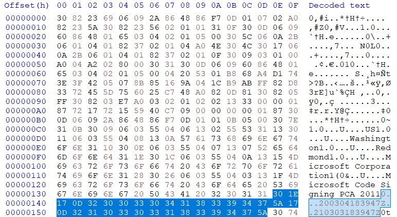

### subject

 - *SEQUENCE*
 - `0x74` bytes
 - offset [`0x15E`, `0x1D3`] 

We can disregard this field.

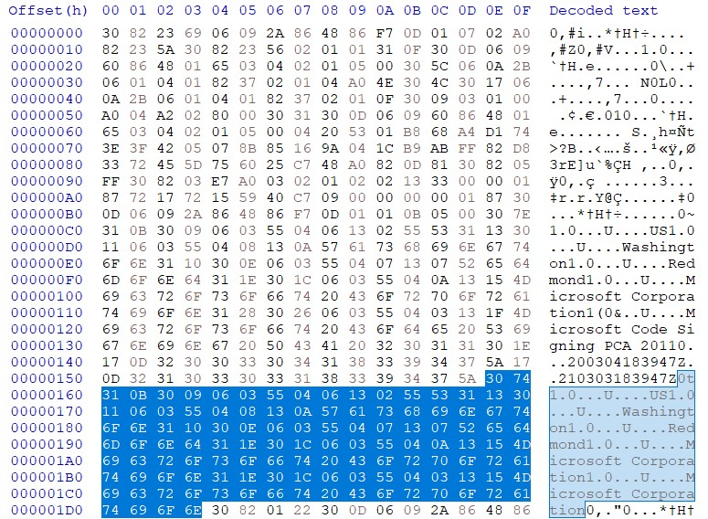

### subjectPublicKeyInfo

```ASN.1
SubjectPublicKeyInfo  ::=  SEQUENCE  {
    algorithm            AlgorithmIdentifier,
    subjectPublicKey     BIT STRING  
}

AlgorithmIdentifier  ::=  SEQUENCE  {
    algorithm               OBJECT IDENTIFIER,
    parameters              ANY DEFINED BY algorithm OPTIONAL  
                            -- contains a value of the type
                            -- registered for use with the
                            -- algorithm object identifier value
}
```

 - *SEQUENCE*
 - `0x122` bytes
 - offset [`0x1D4`, `0x1E6`] 

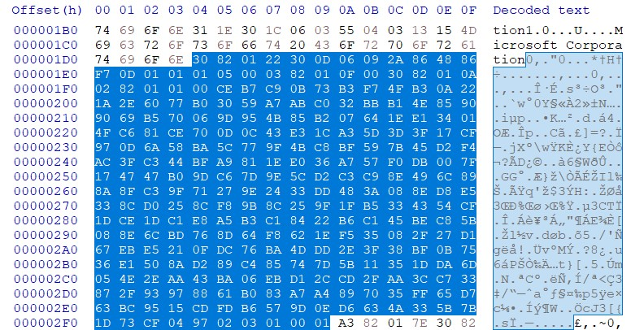

Another important field within a certificate is the public key, which includes the encryption algorithm used for signing and any parameters. These parameters may either hold a value or be null. For instance, in ECDSA, the parameters field specifies the ECDSA type.


Here is a list of common signing encryption algorithms with their OIDs and encoded DER representations:

```
RSA 		    {0x2A, 0x86, 0x48, 0x86, 0xF7, 0x0D, 0x01, 0x01, 0x01}		// 1.2.840.113549.1.1.1
ECDSA 		    {0x2A, 0x86, 0x48, 0xCE, 0x3D, 0x02, 0x01}			        // 1.2.840.10045.2.1
```

And common ECDSA types:

```
P256 (secp256r1)        {0x2A, 0x86, 0x48, 0xCE, 0x3D, 0x03, 0x01, 0x07}		// 1.2.840.10045.3.1.7
P384 (secp384r1)	{0x2B, 0x81, 0x04, 0x00, 0x22}			       		// 1.3.132.0.34
P521 (secp521r1)	{0x2B, 0x81, 0x04, 0x00, 0x23}	 				// 1.3.132.0.35
```

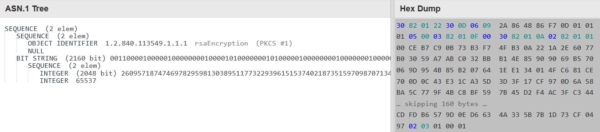

Returning to the binary analysis: the first field within `SubjectPublicKeyInfo` is `algorithm`, which is a *SEQUENCE* containing the encryption algorithm and its parameters.


In our sample, a *SEQUENCE* of `0x0D` bytes spans from offset `0x1D8` to offset `0x1E6`, representing the `algorithm`. The encryption algorithm value is located between offset `0x1DA` and offset `0x1E4` and indicates `rsaEncryption`. The parameters, found between offset `0x1E5` and offset `0x1E6`, are `null`.

Now let’s discuss `subjectPublicKey`. This field is a `BIT STRING`of `0x10F` bytes from offset `0x1E7` to offset `0x2F9`, representing the public key used for signature verification.

Here is the public key:

`30 82 01 0A 02 82 01 01 00 CE B7 C9 0B 73 B3 F7 4F B3 0A 22 1A 2E 60 77 B0 30 59 A7 AB C0 32 BB B1 4E 85 90 90 69 B5 70 06 9D 95 4B 85 B2 07 64 1E E1 34 01 4F C6 81 CE 70 0D 0C 43 E3 1C A3 5D 3D 3F 17 CF 97 0D 6A 58 BA 5C 77 9F 4B C8 BF 59 7B 45 D2 F4 AC 3F C3 44 BF A9 81 1E E0 36 A7 57 F0 DB 00 7F 17 47 47 B0 9D C6 7D 9E 5C D2 C3 C9 8E 49 6C 89 8A 8F C3 9F 71 27 9E 24 33 DD 48 3A 08 8E D8 E5 33 8C D0 25 8C F8 9B 8C 25 9F 1F B5 33 43 54 CF 1D CE 1D C1 E8 A5 B3 C1 84 22 B6 C1 45 BE C8 5B 08 8E 6C BD 76 8D 64 F8 62 1E F5 35 08 2F 27 D1 67 EB E5 21 0F DC 76 BA 4D DD 2E 3F 38 BF 0B 75 36 E1 50 8A D2 89 C4 85 74 7D 5B 11 35 1D DA 6D 05 4E 2E AA 43 BA 06 EB D1 2C CD 2F AA 3C C7 33 87 2F 93 97 88 61 B0 83 A7 A4 89 70 35 FF 65 D7 63 BC 95 15 CD FD B6 57 9D 0E D6 63 4A 33 5B 7B 1D 73 CF 04 97 02 03 01 00 01`

### issuerUniqueID

```ASN.1
UniqueIdentifier  ::=  BIT STRING
```

This field starts with byte *0xA1* indicates *[1] IMPLICIT*. The byte at offset 0x2fA is *0xA3*. So. this field is NOT present for this certificate.

### subjectUniqueID

```ASN.1
UniqueIdentifier  ::=  BIT STRING
```

This field starts with byte *0xA2* indicates *[2] IMPLICIT*. The bytes at offset 0x2fA is *0xA3*. So, this field is NOT present for this certificate.

### extensions

This field starts with byte *0xA3* indicates *[3] EXPLICIT*. The bytes at offset 0x2fA is *0xA3*. So, this field is present for this certificate.certificate.

 - *[3] EXPLICIT* of *SEQUENCE*
 - `0x17A` bytes
 - offset [`0x2fE`, `0x47B`] 

We can disregard this field.

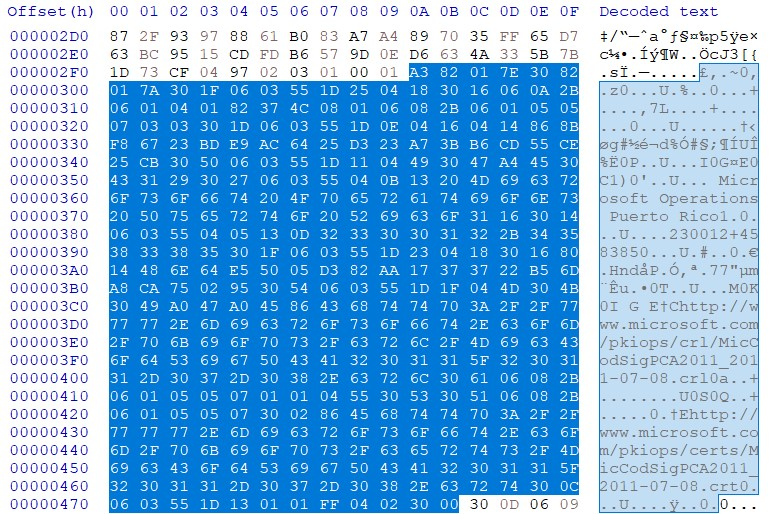

## signatureAlgorithm

 - *SEQUENCE*
 - `0xD` bytes
 - offset [`0x47C`, `0x48A`] 

As mentioned, our focus is solely on the TBSCertificate field, so other fields will be disregarded.

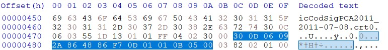

## signatureValue

 - *BIT STRING*
 - `0x201` bytes
 - offset [`0x48B`, `0x68F`] 

As mentioned, our focus is solely on the TBSCertificate field, so other fields will be disregarded.

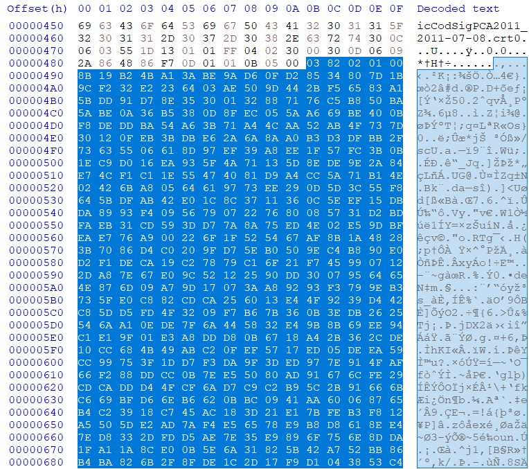

### Calculating thumbprint

Early in this document, we said the thumbprint is not specified in certificate and will be calculated every time you open the *Digital Signatures* dialog. But how?

Thumbprint of a certificate is specified by calculating SHA1 (or in less common cases MD5) hash of bytes array of `Certificate` field. (i.e start from offset *0x8D* to offset *0x68F* for the first certificate and from offset *0x690* to offset *0xE0D* for the second certificate which we did not cover here)

For example for the first certificate we have the following hex sequence:

`308205FF308203E7...17F9D1043853C4`

The result of calculating the SHA1 hash of the sequence is `2485a7afa98e178cb8f30c9838346b514aea4769`. Exactly equivalent to what you've seen before in *Digital Signatures* tab:


## crls

It is another *OPTIONAL* tag of *SignedData* which starts with byte *0xA1* indicates *[1] IMPLICIT*. The bytes at offset *0xE0E* is *0x31*. So, this field does not exist.

## signerInfos

```ASN.1
SignerInfos ::= SET OF SignerInfo

SignerInfo ::= SEQUENCE {
    version                     Version,
    issuerAndSerialNumber       IssuerAndSerialNumber,
    digestAlgorithm             DigestAlgorithmIdentifier,
    authenticatedAttributes     [0] IMPLICIT Attributes OPTIONAL,
    digestEncryptionAlgorithm   DigestEncryptionAlgorithmIdentifier,
    encryptedDigest             EncryptedDigest,
    unauthenticatedAttributes   [1] IMPLICIT Attributes OPTIONAL 
}
```    

`SignerInfos` is one of three important fields of `SignedData`. This field contains signature, hash algorithm, encryption algorithm and certificate serial number of the signer. So, we must delve into lots of the fields to extract the required information.

`SignerInfos` is a `SET OF` data type `SignerInfo`. It means it is possible to exist greater than of one `SignerInfo`. But it is very rarely. In our document, we only discuss about the *SignerInfos* with just one *SignerInfo*. 

Here, `SignerInfos` has size of *0x155B* bytes from offset *0xE0E* to the end. It starts with byte *0x31* indicates *SET OF*. `SignerInfos` hash size of *0x1557* bytes from offset *0xE12* to the end. It starts with byte *0x30* indicates *SEQUENCE*. `SignerInfo` consists of 7 fields as mentioned above.

### version

 - *INTEGER*
 - 1 byte
 - offset [`0xE16`, `0xE18`] 

We can disregard this field.

### Parsing issuerAndSerialNumber

```ASN.1
IssuerAndSerialNumber ::= SEQUENCE {
    issuer Name,
    serialNumber CertificateSerialNumber 
}
    
Name ::= CHOICE { -- only one possibility for now --
    rdnSequence  RDNSequence 
}

RDNSequence ::= SEQUENCE OF RelativeDistinguishedName

RelativeDistinguishedName ::=
    SET SIZE (1..MAX) OF AttributeTypeAndValue

AttributeTypeAndValue ::= SEQUENCE {
    type     AttributeType,
    value    AttributeValue 
}

AttributeType ::= OBJECT IDENTIFIER

AttributeValue ::= ANY -- DEFINED BY AttributeType

CertificateSerialNumber  ::=  INTEGER
```

 - *SEQUENCE*
 - `0x95` bytes
 - offset [`0xE19`, `0xEB0`] 

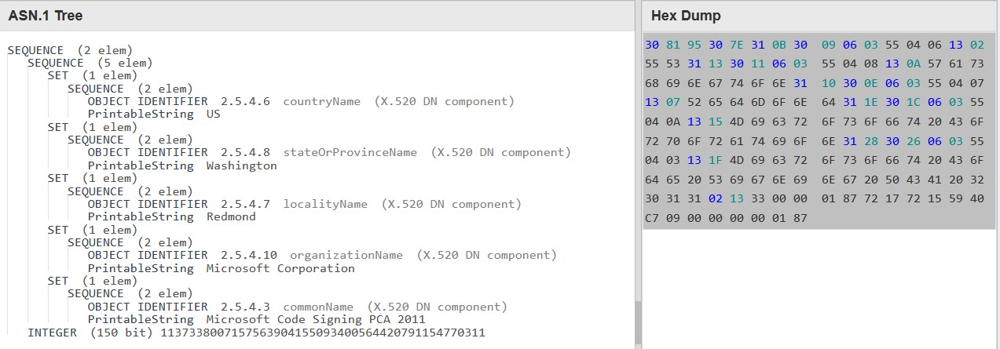

Briefly, it contains two fields. A *SEQUENCE* field named *Name* and an *INTEGER* named *serialNumber*. We discard the first field but the second fields specifies which certificate (that we parsed in previous sections) has signed the PE.

Field *name* has size of *0x7E* bytes from offset *0xE1C* to offset *0xE9B*. We discard this field.

The second field, *serialNumber* is an *INTEGER* with size of *0x13* bytes from offset *0xE9C* to offset *0xEB0*. The value of this field specifies the certificate serial number of the signer. In our example, the value is: 
`33 00 00 01 87 72 17 72 15 59 40 C7 09 00 00 00 00 01 87`

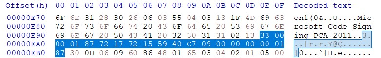

Remember!? The first certificate we have parsed had the same serial number (If you forgot, review the Certificate section). So what? It means we must use the public key of the first certificate to verify the signature!

### Parsing digestAlgorithm

```ASN.1
DigestAlgorithmIdentifier ::= AlgorithmIdentifier

AlgorithmIdentifier  ::=  SEQUENCE  {
    algorithm               OBJECT IDENTIFIER,
    parameters              ANY DEFINED BY algorithm OPTIONAL  
}
```    

 - *SEQUENCE*
 - `0x0D` bytes
 - offset [`0xEB1`, `0xEBF`] 

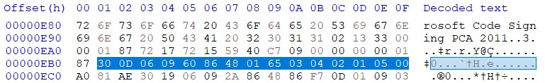

`digestAlgorithm` is the field specifies the hash algorithm by that the PE file is digested. It encompasses two fields `algorithm` and its parameters named `parameters`.


In our example, the hash algorithm is `SHA-256` and the parameters field is `NULL`.

### Parsing authenticatedAttributes

 - *[0] IMPLICIT*
 - `0xAE` bytes
 - offset [`0xEC0`, `0xF70`] 

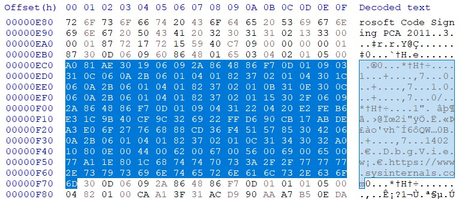

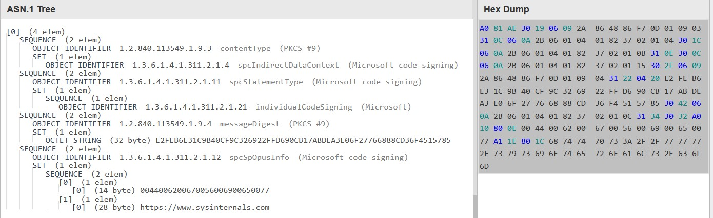

`authenticatedAttributes` consists of some of *SEQUENCE*s  Each *SEQUENCE* itself consists of two fields: an *OBJECT IDENTIFIER* and a *SET*. The most important *SEQUENCE* is the one with starts with OID `1.2.840.113549.1.9.4` which specifies `messageDigest`. In *SET* field of that, exist and *OCTET STRING* which specifies a value which is digest of *contentInfo*. The value must be same with the hash we calculated  berfore in *contentInfo* section.

Here the value is `E2FEB6E31C9B40CF9C326922FFD690CB17ABDEA3E06F27766888CD36F4515785`. Please go back to the *contentInfo* section and checks is same. 😁

Here is the step three (and final step) of creating the message must be signed. This section contains `contentInfo` which itself contains PE image hash. So, calculating hash of `authenticatedAttributes` is a good choice for signing. But how?

`authenticatedAttributes` is a little bit tricky. According to RFC, the tag of this field must be change from `[0] IMPLICIT OPTIONAL` (`0xA0`) to `SET` (`0x31`) and then calculating the hash. So:

`A0 81 AE ... 63 6F 6D` -> `31 81 AE ... 63 6F 6D`

The final message is:

`31 81 AE 30 19 06 09 2A 86 48 86 F7 0D 01 09 03 31 0C 06 0A 2B 06 01 04 01 82 37 02 01 04 30 1C 06 0A 2B 06 01 04 01 82 37 02 01 0B 31 0E 30 0C 06 0A 2B 06 01 04 01 82 37 02 01 15 30 2F 06 09 2A 86 48 86 F7 0D 01 09 04 31 22 04 20 E2 FE B6 E3 1C 9B 40 CF 9C 32 69 22 FF D6 90 CB 17 AB DE A3 E0 6F 27 76 68 88 CD 36 F4 51 57 85 30 42 06 0A 2B 06 01 04 01 82 37 02 01 0C 31 34 30 32 A0 10 80 0E 00 44 00 62 00 67 00 56 00 69 00 65 00 77 A1 1E 80 1C 68 74 74 70 73 3A 2F 2F 77 77 77 2E 73 79 73 69 6E 74 65 72 6E 61 6C 73 2E 63 6F 6D`

Congrats! It's the message must be used when you want to verify the signature. But where is the signature!? Keep it up!

*Note: Based on the specified algorithm in previous section, we calculating `SHA-256` over the modified `authenticatedAttributes` field and the result is: `79007003e5756941bb23b36e2e599782277c22cb27b409497425be8e75637379`. Actually, calculating the hash is not mandatory. If you decrypt the signature (which we will reach to it next sub-sections) you can find this hash.*

### Parsing digestEncryptionAlgorithm

```ASN.1
DigestEncryptionAlgorithmIdentifier ::= AlgorithmIdentifier

AlgorithmIdentifier  ::=  SEQUENCE  {
    algorithm               OBJECT IDENTIFIER,
    parameters              ANY DEFINED BY algorithm OPTIONAL
}
```

 - *SEQUENCE*
 - `0x0D` bytes
 - offset [`0xF71`, `0xF7F`] 

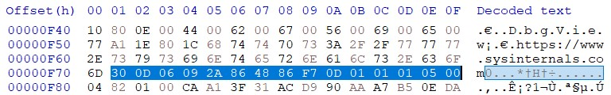

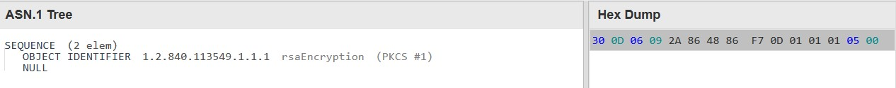

`DigestEncryptionAlgorithmIdentifier` is the field specifies the encryption algorithm the hash of modified `authenticatedAttributes` is encrypted by. It encompasses two fields `algorithm` and its parameters named `parameters`.

It consists of `algorithm` and its `parameters`. In our case the first one is `RSA` and the second one is `NULL`. We discussed about the object id of encryption algorithm before.

### Parsing encryptedDigest

 - *OCTET STRING*
 - `0x100` bytes
 - offset [`0xF80`, `0x1083`] 

`encryptedDigest` is the final field we delve into. Here is its value:

`CA A1 3F 31 AC D9 90 AA A7 B5 0E DA 79 0F 46 FB FB 22 93 F3 CB 8D D6 0B 6C 33 10 93 29 9E F8 E9 10 BE 2B AD 0E 1E 7D 42 88 49 2B 14 79 13 EC 13 13 85 25 17 C5 4F B6 96 F8 DC E3 9A 77 2E E3 D7 CF 8C 9B FC EE 31 61 3A 74 25 30 2F 5B E1 D1 98 BC F9 CA 3F F9 D0 5B AA 79 24 8A 95 3D 7F E7 93 A8 7B D9 FE 70 BC AA 9A 63 B2 3B 8F 59 1F 49 B4 F5 2A ED 9A B1 9F 94 98 FE E2 20 BD 35 A3 EF E9 A9 B3 CA 3D FF 41 89 E3 F0 AC 92 AF 52 F7 47 22 F8 01 AB 96 34 B9 AA 73 5F FA 60 C1 3B E9 C4 0C 91 5F FC 34 1F 14 79 27 B2 DC 00 DD 99 DB B9 4E A8 23 70 CF 1D C9 49 07 60 0E FA A0 E9 3E 32 45 81 87 65 C7 9B 11 2D 9D 8F A9 1A C0 55 13 27 82 33 1F F2 26 7A 00 22 61 75 34 08 13 80 1C 0D 74 80 89 D5 9B FB 72 13 97 52 78 98 71 35 35 01 B4 9A 65 5F DC CD E8 0F 50 03 66 0D 2A F1 A5 65 02`

Ladies and Gentlemen, finally we reached to the signature! Here is the signature we must verify it against the digest we calculated in section `authenticatedAttributes`.

### Parsing unauthenticatedAttributes

From offset *0x1084* to the end of the file. Discarded!

## Verifying the Signature

Let's gather our information in one place here:

message:

`31 81 AE 30 19 06 09 2A 86 48 86 F7 0D 01 09 03 31 0C 06 0A 2B 06 01 04 01 82 37 02 01 04 30 1C 06 0A 2B 06 01 04 01 82 37 02 01 0B 31 0E 30 0C 06 0A 2B 06 01 04 01 82 37 02 01 15 30 2F 06 09 2A 86 48 86 F7 0D 01 09 04 31 22 04 20 E2 FE B6 E3 1C 9B 40 CF 9C 32 69 22 FF D6 90 CB 17 AB DE A3 E0 6F 27 76 68 88 CD 36 F4 51 57 85 30 42 06 0A 2B 06 01 04 01 82 37 02 01 0C 31 34 30 32 A0 10 80 0E 00 44 00 62 00 67 00 56 00 69 00 65 00 77 A1 1E 80 1C 68 74 74 70 73 3A 2F 2F 77 77 77 2E 73 79 73 69 6E 74 65 72 6E 61 6C 73 2E 63 6F 6D`

signature:

`CA A1 3F 31 AC D9 90 AA A7 B5 0E DA 79 0F 46 FB FB 22 93 F3 CB 8D D6 0B 6C 33 10 93 29 9E F8 E9 10 BE 2B AD 0E 1E 7D 42 88 49 2B 14 79 13 EC 13 13 85 25 17 C5 4F B6 96 F8 DC E3 9A 77 2E E3 D7 CF 8C 9B FC EE 31 61 3A 74 25 30 2F 5B E1 D1 98 BC F9 CA 3F F9 D0 5B AA 79 24 8A 95 3D 7F E7 93 A8 7B D9 FE 70 BC AA 9A 63 B2 3B 8F 59 1F 49 B4 F5 2A ED 9A B1 9F 94 98 FE E2 20 BD 35 A3 EF E9 A9 B3 CA 3D FF 41 89 E3 F0 AC 92 AF 52 F7 47 22 F8 01 AB 96 34 B9 AA 73 5F FA 60 C1 3B E9 C4 0C 91 5F FC 34 1F 14 79 27 B2 DC 00 DD 99 DB B9 4E A8 23 70 CF 1D C9 49 07 60 0E FA A0 E9 3E 32 45 81 87 65 C7 9B 11 2D 9D 8F A9 1A C0 55 13 27 82 33 1F F2 26 7A 00 22 61 75 34 08 13 80 1C 0D 74 80 89 D5 9B FB 72 13 97 52 78 98 71 35 35 01 B4 9A 65 5F DC CD E8 0F 50 03 66 0D 2A F1 A5 65 02`

public key:

`30 82 01 0A 02 82 01 01 00 CE B7 C9 0B 73 B3 F7 4F B3 0A 22 1A 2E 60 77 B0 30 59 A7 AB C0 32 BB B1 4E 85 90 90 69 B5 70 06 9D 95 4B 85 B2 07 64 1E E1 34 01 4F C6 81 CE 70 0D 0C 43 E3 1C A3 5D 3D 3F 17 CF 97 0D 6A 58 BA 5C 77 9F 4B C8 BF 59 7B 45 D2 F4 AC 3F C3 44 BF A9 81 1E E0 36 A7 57 F0 DB 00 7F 17 47 47 B0 9D C6 7D 9E 5C D2 C3 C9 8E 49 6C 89 8A 8F C3 9F 71 27 9E 24 33 DD 48 3A 08 8E D8 E5 33 8C D0 25 8C F8 9B 8C 25 9F 1F B5 33 43 54 CF 1D CE 1D C1 E8 A5 B3 C1 84 22 B6 C1 45 BE C8 5B 08 8E 6C BD 76 8D 64 F8 62 1E F5 35 08 2F 27 D1 67 EB E5 21 0F DC 76 BA 4D DD 2E 3F 38 BF 0B 75 36 E1 50 8A D2 89 C4 85 74 7D 5B 11 35 1D DA 6D 05 4E 2E AA 43 BA 06 EB D1 2C CD 2F AA 3C C7 33 87 2F 93 97 88 61 B0 83 A7 A4 89 70 35 FF 65 D7 63 BC 95 15 CD FD B6 57 9D 0E D6 63 4A 33 5B 7B 1D 73 CF 04 97 02 03 01 00 01`

We provided a python code to verify the signature automatically:

```py
from Crypto.PublicKey import RSA
from Crypto.Signature import PKCS1_v1_5
from Crypto.Hash import SHA256
import binascii

def verify_signature(public_key_hex, signature_hex, message_hex):
    # Convert the hex strings back to bytes
    public_key_bytes = binascii.unhexlify(public_key_hex)
    signature_bytes = binascii.unhexlify(signature_hex)
    message_bytes = binascii.unhexlify(message_hex)
    
    # Import the public key
    public_key = RSA.import_key(public_key_bytes)
    
    # Create a SHA-256 hash object of the message
    h = SHA256.new(message_bytes)
    
    # Create a PKCS1_v1_5 signature verifier
    verifier = PKCS1_v1_5.new(public_key)
    
    # Verify the signature
    if verifier.verify(h, signature_bytes):
        return True
    else:
        return False

message_hex = '3181AE301906092A864886F70D010903310C060A2B060104018237020104301C060A2B06010401823702010B310E300C060A2B060104018237020115302F06092A864886F70D01090431220420E2FEB6E31C9B40CF9C326922FFD690CB17ABDEA3E06F27766888CD36F45157853042060A2B06010401823702010C31343032A010800E0044006200670056006900650077A11E801C68747470733A2F2F7777772E737973696E7465726E616C732E636F6D'
signature_hex = 'CAA13F31ACD990AAA7B50EDA790F46FBFB2293F3CB8DD60B6C331093299EF8E910BE2BAD0E1E7D4288492B147913EC1313852517C54FB696F8DCE39A772EE3D7CF8C9BFCEE31613A7425302F5BE1D198BCF9CA3FF9D05BAA79248A953D7FE793A87BD9FE70BCAA9A63B23B8F591F49B4F52AED9AB19F9498FEE220BD35A3EFE9A9B3CA3DFF4189E3F0AC92AF52F74722F801AB9634B9AA735FFA60C13BE9C40C915FFC341F147927B2DC00DD99DBB94EA82370CF1DC94907600EFAA0E93E3245818765C79B112D9D8FA91AC055132782331FF2267A00226175340813801C0D748089D59BFB72139752789871353501B49A655FDCCDE80F5003660D2AF1A56502'
public_key_hex = '3082010A0282010100CEB7C90B73B3F74FB30A221A2E6077B03059A7ABC032BBB14E85909069B570069D954B85B207641EE134014FC681CE700D0C43E31CA35D3D3F17CF970D6A58BA5C779F4BC8BF597B45D2F4AC3FC344BFA9811EE036A757F0DB007F174747B09DC67D9E5CD2C3C98E496C898A8FC39F71279E2433DD483A088ED8E5338CD0258CF89B8C259F1FB5334354CF1DCE1DC1E8A5B3C18422B6C145BEC85B088E6CBD768D64F8621EF535082F27D167EBE5210FDC76BA4DDD2E3F38BF0B7536E1508AD289C485747D5B11351DDA6D054E2EAA43BA06EBD12CCD2FAA3CC733872F93978861B083A7A4897035FF65D763BC9515CDFDB6579D0ED6634A335B7B1D73CF04970203010001'

# Verify the signature
is_valid = verify_signature(public_key_hex, signature_hex, message_hex)
print("Signature is valid:", is_valid)
```

As you guess, the result of executing the script is 
```shell
$ python3 signature_verification.py
Signature is valid: True
```

Mission is accomplished! 😁 

## Decrypting the Signature

It's a little bit odd to decrypt the signature but we don't want to end this game. We provide a python code to decrypt the signature and get what was signed:

```py
from Crypto.PublicKey import RSA
import binascii

def decrypt_signature(public_key_hex, signature_hex):
    # Convert the hex strings back to bytes
    public_key_bytes = binascii.unhexlify(public_key_hex)
    signature_bytes = binascii.unhexlify(signature_hex)
    
    # Import the public key
    rsa_key = RSA.importKey(public_key_bytes)
    
    # Manually decrypt the signature by simulating the public key decrypt operation
    modulus = rsa_key.n
    modulus_len = rsa_key.size_in_bytes()

    # Convert the signature into an integer
    signature_int = int.from_bytes(signature_bytes, byteorder='big')

    # Perform the RSA "decryption" (modular exponentiation)
    recovered_plaintext_int = pow(signature_int, rsa_key.e, modulus)

    # Convert the decrypted integer back to bytes
    recovered_plaintext_bytes = recovered_plaintext_int.to_bytes(modulus_len, byteorder='big')

    # Output the padded plaintext. You would need to strip the padding.
    print("\nRecovered the plaintext (with padding)")
    print(' '.join(f'{byte:02X}' for byte in recovered_plaintext_bytes))

    # PKCS#1 v1.5 padding starts with 0x00 0x01 followed by padding bytes (0xFF), and then the plaintext.
    # Remove the padding manually (look for the 0x00 separator)
    padding_separator_index = recovered_plaintext_bytes.index(b'\x00', 2)  # First two bytes are 0x00 0x01
    plaintext = recovered_plaintext_bytes[padding_separator_index+1:]

    # Print the plaintext
    print("\nRecovered the plaintext")
    print(' '.join(f'{byte:02X}' for byte in plaintext))    

    
# Decrypt the signature
signature_hex = 'CAA13F31ACD990AAA7B50EDA790F46FBFB2293F3CB8DD60B6C331093299EF8E910BE2BAD0E1E7D4288492B147913EC1313852517C54FB696F8DCE39A772EE3D7CF8C9BFCEE31613A7425302F5BE1D198BCF9CA3FF9D05BAA79248A953D7FE793A87BD9FE70BCAA9A63B23B8F591F49B4F52AED9AB19F9498FEE220BD35A3EFE9A9B3CA3DFF4189E3F0AC92AF52F74722F801AB9634B9AA735FFA60C13BE9C40C915FFC341F147927B2DC00DD99DBB94EA82370CF1DC94907600EFAA0E93E3245818765C79B112D9D8FA91AC055132782331FF2267A00226175340813801C0D748089D59BFB72139752789871353501B49A655FDCCDE80F5003660D2AF1A56502'
public_key_hex = '3082010A0282010100CEB7C90B73B3F74FB30A221A2E6077B03059A7ABC032BBB14E85909069B570069D954B85B207641EE134014FC681CE700D0C43E31CA35D3D3F17CF970D6A58BA5C779F4BC8BF597B45D2F4AC3FC344BFA9811EE036A757F0DB007F174747B09DC67D9E5CD2C3C98E496C898A8FC39F71279E2433DD483A088ED8E5338CD0258CF89B8C259F1FB5334354CF1DCE1DC1E8A5B3C18422B6C145BEC85B088E6CBD768D64F8621EF535082F27D167EBE5210FDC76BA4DDD2E3F38BF0B7536E1508AD289C485747D5B11351DDA6D054E2EAA43BA06EBD12CCD2FAA3CC733872F93978861B083A7A4897035FF65D763BC9515CDFDB6579D0ED6634A335B7B1D73CF04970203010001'

decrypt_signature(public_key_hex, signature_hex)
```

And the result is:

```shell
$ python3 signature_decryption.py

Recovered the plaintext (with padding)
00 01 FF FF FF FF FF FF FF FF FF FF FF FF FF FF FF FF FF FF FF FF FF FF FF FF FF FF FF FF FF FF FF FF FF FF FF FF FF FF FF FF FF FF FF FF FF FF FF FF FF FF FF FF FF FF FF FF FF FF FF FF FF FF FF FF FF FF FF FF FF FF FF FF FF FF FF FF FF FF FF FF FF FF FF FF FF FF FF FF FF FF FF FF FF FF FF FF FF FF FF FF FF FF FF FF FF FF FF FF FF FF FF FF FF FF FF FF FF FF FF FF FF FF FF FF FF FF FF FF FF FF FF FF FF FF FF FF FF FF FF FF FF FF FF FF FF FF FF FF FF FF FF FF FF FF FF FF FF FF FF FF FF FF FF FF FF FF FF FF FF FF FF FF FF FF FF FF FF FF FF FF FF FF FF FF FF FF FF FF FF FF FF FF FF FF FF FF FF FF FF FF FF FF 00 30 31 30 0D 06 09 60 86 48 01 65 03 04 02 01 05 00 04 20 79 00 70 03 E5 75 69 41 BB 23 B3 6E 2E 59 97 82 27 7C 22 CB 27 B4 09 49 74 25 BE 8E 75 63 73 79

Recovered the plaintext
30 31 30 0D 06 09 60 86 48 01 65 03 04 02 01 05 00 04 20 79 00 70 03 E5 75 69 41 BB 23 B3 6E 2E 59 97 82 27 7C 22 CB 27 B4 09 49 74 25 BE 8E 75 63 73 79
```

By ignoring some details, we got a padded plaintext. According to [RFC of PKCS1-v1_5](https://www.rfc-editor.org/rfc/rfc8017#section-9.2), the recovered plaintext is based on this structure:

```
EM = 0x00 || 0x01 || PS || 0x00 || T

M = Message to be encoded
H = Hash(M)

EM = Encoded Message
PS = An octet string with value 0xff
T  = DER encoding of:
	 DigestInfo ::= SEQUENCE {
		 digestAlgorithm AlgorithmIdentifier,
		 digest OCTET STRING
	 }

	 All possible value of T per different hash algorithm:
	 * MD2:         30 20 30 0c 06 08 2a 86 48 86 f7 0d 02 02 05 00 04 10 || H.
	 * MD5:         30 20 30 0c 06 08 2a 86 48 86 f7 0d 02 05 05 00 04 10 || H.
	 * SHA-1:       30 21 30 09 06 05 2b 0e 03 02 1a 05 00 04 14 || H.
	 * SHA-224:     30 2d 30 0d 06 09 60 86 48 01 65 03 04 02 04 05 00 04 1c || H.
	 * SHA-256:     30 31 30 0d 06 09 60 86 48 01 65 03 04 02 01 05 00 04 20 || H.
	 * SHA-384:     30 41 30 0d 06 09 60 86 48 01 65 03 04 02 02 05 00 04 30 || H.
	 * SHA-512:     30 51 30 0d 06 09 60 86 48 01 65 03 04 02 03 05 00 04 40 || H.
	 * SHA-512/224: 30 2d 30 0d 06 09 60 86 48 01 65 03 04 02 05 05 00 04 1c || H.
	 * SHA-512/256: 30 31 30 0d 06 09 60 86 48 01 65 03 04 02 06 05 00 04 20 || H.
```

Briefly, the padded plaintext starts with two bytes `0x00 0x01` and continues with lots of `oxFF` bytes named `PS`. `PS` terminates with byte `0x00`. Here are the starts of ASN.1 content:

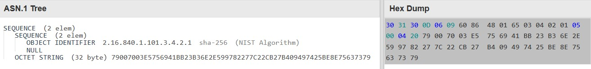

As you can see, it is specifying the digest algorithm (`SHA-256`) and the digest value (`79007003e5756941bb23b36e2e599782277c22cb27b409497425be8e75637379`).

Remember this digest value? It's the digest over the modified `authenticatedAttributes` we calculated in previous sub-sections.

# Illustrative Summary of Content to be digested

# Appendix A: Calculating the PE Image Hash

As mentioned before, calculating the PE image hash is not strait-forward. So, you cannot get digest over the PE image file and considred it as PE hash. We want to delve info how can we do it based on [Microsoft Document](https://download.microsoft.com/download/9/c/5/9c5b2167-8017-4bae-9fde-d599bac8184a/Authenticode_PE.docx).

First of all, take a look at it this figure:

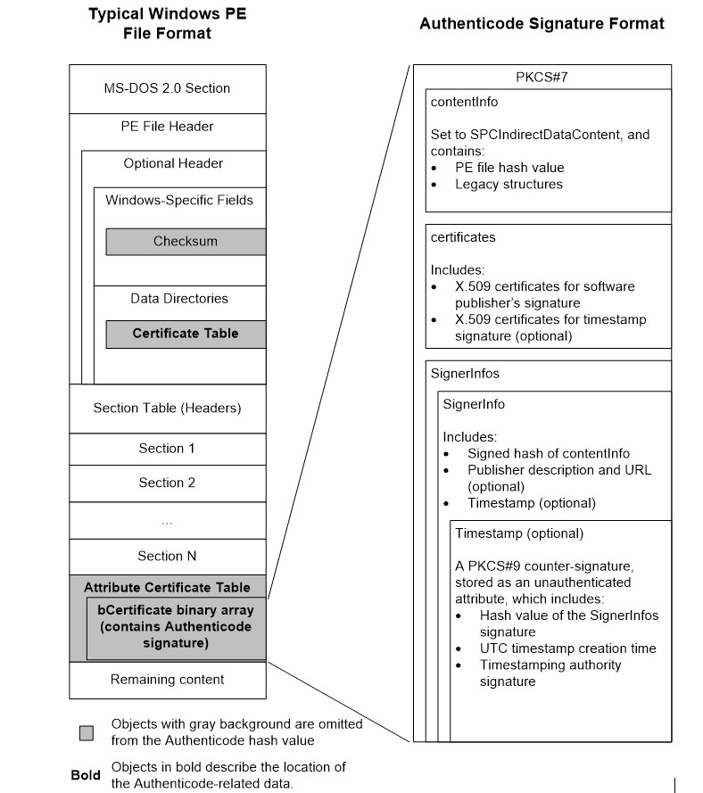

All parts except for the gray ones must get involved in calculating the digest.

As brief, you must do following rules in order to create a buffer which is used in calculate the PE image digest:
1. Copy from the begging of the file to the beginning file offset of `Checksum` in OPTIONAL_HEADER of PE to the buffer.
2. Discard `Checksum` fields. The size of this field is *4 bytes*.
3. Copy from the end file offset of `Checksum` to beginning file offset of `IMAGE_DIRECTORY_ENTRY_SECURITY` of OPTIONAL_HEADER.DATA_DIRECTORY in PE to the buffer. This directory indicates where the certificate in PE file is located.
4. Discard `IMAGE_DIRECTORY_ENTRY_SECURITY` directory. The size of this directory is *8 bytes*.
5. Copy from the end file offset of `IMAGE_DIRECTORY_ENTRY_SECURITY` to the beginning of security directory RVA to the buffer.
6. Discard Certificate section. This part are as large as the size is specified in security directory.
7. Copy the remained bytes to the buffer.

Creating digest over the above buffer to get the PE image file hash.

*Note: In microsoft document, there is an extra rule specifies the section must be inserted in the buffer in ascending order based on the their PointerToRawData. I'm not sure! If you have more information plz share with me.*

We provide a python code to do the above rules automatically for us:

```py
import pefile
import hashlib
import sys

pe = pefile.PE(sys.argv[1], fast_load=True) 

# Extract Security directory
security_directory = pe.OPTIONAL_HEADER.DATA_DIRECTORY[pefile.DIRECTORY_ENTRY['IMAGE_DIRECTORY_ENTRY_SECURITY']]    

# CheckSum file offset
checksum_offset = pe.OPTIONAL_HEADER.dump_dict()['CheckSum']['FileOffset']  

# IMAGE_DIRECTORY_ENTRY_SECURITY file offset
certificate_table_offset = security_directory.dump_dict()['VirtualAddress']['FileOffset'] 

# Certificate section virtual address and size
certificate_virtual_addr = security_directory.VirtualAddress
certificate_size = security_directory.Size

# Read PE image file
raw_data = pe.__data__

# Skip OptionalHeader.CheckSum field and continue until IMAGE_DIRECTORY_ENTRY_SECURITY
buffer = raw_data[:checksum_offset] + raw_data[checksum_offset+0x04:certificate_table_offset]   

# Skip IMAGE_DIRECTORY_ENTRY_SECURITY and certificate if exist
if certificate_virtual_addr == 0 or certificate_size == 0:
    buffer += raw_data[certificate_table_offset+0x08:]
else:
    buffer += raw_data[certificate_table_offset+0x08:certificate_virtual_addr] + raw_data[certificate_virtual_addr+certificate_size:]   

# Digest of PE image file
print(f"MD5:\t {hashlib.md5(buffer).hexdigest()}")
print(f"SHA1:\t {hashlib.sha1(buffer).hexdigest()}")
print(f"SHA256:\t {hashlib.sha256(buffer).hexdigest()}")
```

Let's ecevute the script for our sample file, `dbgview64.exe`:

```shell
$ python3 pe_image_hash_calculator.py dbgview64.exe
MD5:     29c22bf29b3e9e7b1d9ef9d7fc2631f0
SHA1:    572c2afd655367ff33351796fb8039935443d93d
SHA256:  5301b868a4d1743e3f4205078b85169a041cb9abff82d83372455d756025c748
```

Do you remember this hash? In `contentInfo` section we provide this hash. Go back and check again.

In the beginning of this document, we calculated the digest of `notepad.exe`. Let's re-calculated the digest but this time by using the python script:

```shell


```

# Appendix B: A Brief Introduction to ASN.1

ASN.1 (Abstract Syntax Notation One) is a standardized language used to describe data structures for representing, encoding, transmitting, and decoding data. It is widely used in telecommunications, cryptography, and networking protocols for defining complex data types in a platform-independent way.

Here are some most used data types (or tags): `BOOLEAN`, `INTEGER`, `BIT STRING`, `OCTET STRING`, `NULL`, `OBJECT IDENTIFIER`, `SEQUENCE` and `SET`.

Some examples are provided:

```ASN.1
Age ::= INTEGER
```

```ASN.1
MySequence ::= SEQUENCE {
    flag    BOOLEAN,
    number  INTEGER
}
```

```ASN.1
 Product ::= SEQUENCE {
    productId    INTEGER,
    productName  UTF8String,
    price        REAL
}
```

## DER Encoding Rules

DER encoding follows an encoding rules, ensuring a single, unambiguous encoding for each ASN.1 data structure. DER encoding is typically represented using Tag-Length-Value (TLV) triplets.

Components of DER Encoding

+------+-------+-------+

| Tag | Length | Value |

+------+-------+-------+

- **Tag**: Indicates the data type and class.
- **Length**: Specifies the length of the value in bytes.
- **Value**: The actual data content.

Here are some data types with their DER tag bytes:

TAG | Byte
--- | ---
BOOLEAN | 0x01
INTEGER | 0x02
BIT STRING | 0x03
OCTET STRING | 0x04
NULL | 0x05
OBJECT IDENTIFIER | 0x06
SEQUENCE and SEQUENCE OF| 0x30
SET and SET OF | 0x31

### BOOLEAN

Represents a boolean value, either `TRUE` or `FALSE`. In DER, `FALSE` is encoded as `0x00`, and `TRUE` is encoded as any non-zero value, typically `0xFF`.

Example:

```ASN.1
isActive BOOLEAN ::= TRUE
```

DER Encoding:
```
01 01 FF
```

<details>
  <summary>Details</summary>

```
Tag:        0x01
Length:     0x01
Content:    0xFF
```
</details>

### INTEGER

Represents whole numbers. The INTEGER type can encode positive and negative values. DER requires the smallest possible number of octets to represent the value, and for negative numbers, it uses two's complement.

Example:
```ASN.1
age INTEGER ::= 25
```

DER Encoding:
```
02 01 19
```

<details>
  <summary>Details</summary>

```
Tag:        0x02
Length:     0x01
Content:    0x19
```
</details>

### BIT STRING

Represents a string of bits. The first byte indicates the number of unused bits in the final octet.

Example:
```ASN.1
flags BIT STRING ::= '10110010'B
```

DER Encoding:
```
03 02 00 B2
```

<details>
  <summary>Details</summary>

```
Tag:        0x03
Length:     0x02
Content:    0x00 0xB2
```
</details>

### OCTET STRING

Represents a sequence of octets (bytes). It is commonly used to hold binary data.

Example:
```ASN.1
data OCTET STRING ::= 'Hello'H
```

DER Encoding:
```
04 05 48 65 6C 6C 6F
```

<details>
  <summary>Details</summary>

```
Tag:        0x04
Length:     0x05
Content:    48 65 6C 6C 6F ('H' 'e' 'l' 'l' 'o' in ASCII)
```
</details>

### NULL

Represents a NULL value. It has no content; the length is always zero.

Example:
```ASN.1
placeholder NULL ::= NULL
```

DER Encoding:
```
05 00
```

<details>
  <summary>Details</summary>

```
Tag:        0x05
Length:     0x00
Content:    (none)
```
</details>

### OBJECT IDENTIFIER

Represents an object identifier, which is a globally unique identifier used in many standards (e.g., OIDs in certificates). It consists of a series of integers separated by dots.

Example:
```ASN.1
idExample OBJECT IDENTIFIER ::= { iso(1) member-body(2) us(840) example(113549) 1 }
```

DER Encoding:
```
06 07 2A 86 48 86 F7 0D 01
```

<details>
  <summary>Details</summary>

```
Tag:        0x06
Length:     0x07
Content:    2A 86 48 86 F7 0D 01
```

*Explanation:*

The first two numbers `1.2` are encoded as `40 * 1 + 2 = 42` which is `0x2A`.
The subsequent numbers are encoded in base 128 with the high bit set for all but the last byte in each sub-identifier.
</details>

### SEQUENCE

Represents a sequence of ordered elements, similar to a struct in programming languages. It is a constructed type, meaning it contains other ASN.1 types.

Example:
```ASN.1
Person SEQUENCE ::= {
    name    OCTET STRING,
    age     INTEGER,
    isActive BOOLEAN
}

-- Example Instance:
name    = "Alice"
age     = 30
isActive = TRUE
```

DER Encoding:
```
30 0D 04 05 41 6C 69 63 65 02 01 1E 01 01 FF
```

<details>
  <summary>Details</summary>

```
Tag:        0x30 (SEQUENCE)
Length:     Variable
Content:
    -- name OCTET STRING
    04 05 41 6C 69 63 65
    -- age INTEGER
    02 01 1E
    -- isActive BOOLEAN
    01 01 FF
```
</details>

### SET

Represents an unordered collection of elements. Like SEQUENCE, it is a constructed type but does not preserve the order of elements. DER requires that the elements within a SET are encoded in ascending order based on their tag values.

Example:
```ASN.1
Attributes SET ::= {
    height INTEGER,
    weight INTEGER
}

-- Example Instance:
height = 170
weight = 65
```

DER Encoding:
```
31 06 02 02 00 AA 02 01 41
```

<details>
  <summary>Details</summary>

```
Tag:        0x31 (SET)
Length:     Variable
Content:
    -- height INTEGER
    02 02 00 AA (170 in hex is 0x00AA to ensure positive)
    -- weight INTEGER
    02 01 41 (65 in hex is 0x41)
```
</details>

### SEQUENCE OF

 - `SEQUENCE OF` represents an ordered collection of elements, where the order of elements matters and is preserved in the encoding.
 - The type of all elements within the sequence must be the same.

Example:
```ASN.1
Grades SEQUENCE OF INTEGER ::= {85, 90, 75}
```

DER Encoding:
```
30 09 02 01 55 02 01 5A 02 01 4B
```

<details>
  <summary>Details</summary>

```
Tag:        0x30 (SEQUENCE)
Length:     0x09
Content:
    -- First INTEGER (85)
    02 01 55
    -- Second INTEGER (90)
    02 01 5A
    -- Third INTEGER (75)
    02 01 4B
```
</details>

### SET OF

 - `SET OF` represents an unordered collection of elements. The order does not matter, but in DER, elements must be encoded in ascending order of their tags or content when tags are the same.
 - Like `SEQUENCE OF`, all elements must be of the same type.

Example:
```ASN.1
UniqueIds SET OF INTEGER ::= {5, 100, 20}
```

DER Encoding:
```
31 07 02 01 05 02 01 14 02 01 64
```

<details>
  <summary>Details</summary>

```
Tag:        0x31 (SET)
Length:     0x07
Content:
    -- First INTEGER (5)
    02 01 05
    -- Second INTEGER (20)
    02 01 14
    -- Third INTEGER (100)
    02 01 64
```
</details>

### EXPLICIT TAG

Suppose:
```ASN.1
PersonInfo ::= SEQUENCE {
    age        INTEGER OPTIONAL,
    idNumber   INTEGER OPTIONAL
}
```

Both fields are optional. Imagine `PersonInfo` in two conditions in which consists just one field.

DER encoding when `PersonInfo` only consists of `age` with value of `7`:        `30 04 03 01 07`

DER encoding when `PersonInfo` only consists of `idNumber` with value of `7`:   `30 04 03 01 07`

Both encoding are same. How can we ditiguish between them in decoding? The solution is using `EXPLICIT` or `IMPLICIT`. Here, we only cover `EXPLICIT`.

```ASN.1
PersonInfo ::= SEQUENCE {
    age        [0] EXPLICIT INTEGER OPTIONAL,
    idNumber   [1] EXPLICIT INTEGER OPTIONAL
}
```

EXPLICIT tags are used to differentiate between them. The EXPLICIT tag wraps the base type (INTEGER) with an additional tag to distinguish one field from the other.

**Case 1:** Only `age` is present

```ASN.1
PersonInfo ::= {
    age = 0x07
}
```

```
30 05 A0 03 02 01 07
```

`A0` indicates the `age` field with `EXPLICIT` tag `[0]`. 

**Case 2:** Only `idNumber` is present

```ASN.1
PersonInfo ::= {
    idNumber = 0x07
}
```

```
30 05 A1 03 02 01 07
```

`A1` indicates the `idNumber` field with `EXPLICIT` tag `[1]`.

**Case 3:** Both `age` and `idNumber` are present

```ASN.1
PersonInfo ::= {
    age = 0x07,
    idNumber = 0x07
}
```

```
30 0B A0 03 02 01 07 A1 03 02 02 07
```

# Appendix C: Most Important Fields of PKCS7

Field | usage
--- | ---
SignedData - contentInfo | Digest of this field will be used in authenticatedAttributes
SignedData - contentInfo - digestAlgorithm | Specifies the algorithm the hash of PE image file is calculated by
SignedData - contentInfo - digest | Contains digest of PE image file
SignedData - Certificate - Certificate | Hash of this field is the thumbprint of the certificate
SignedData - Certificate - TBSCertificate - serialNumber | Serial number of the certificate
SignedData - Certificate - TBSCertificate - subjectPublicKeyInfo | Encryption algorithm and its parameters along with public key
SignedData - SignerInfo - issuerAndSerialNumber | Certificate serial number of the signer of the PE
SignedData - SignerInfo - digestAlgorithm | Specifies the algorithm the hash of authenticatedAttributes is calculated by
SignedData - SignerInfo - authenticatedAttributes | The message the signature will be verified by
SignedData - SignerInfo - digestEncryptionAlgorithm | Specifies the algorithm authenticatedAttributes is signed by
SignedData - SignerInfo - encryptedDigest | Signature
