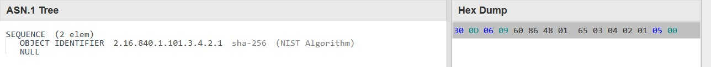

# Verifying Embedded PE Signature

# What Do We Cover?

For a given signed PE file, with the signature embedded, we extract the signature and certificates. These are then parsed using PKCS and ASN.1 standards.

# What We Don't Cover

- PE files whose digital signatures are not embedded (reside in catalog files)
- Validating timestamp of the signatures
- Validating the key usage
- Validating the chain of the certificates
- Using Windows APIs like `WinTrust` to verify signatures
- A full tutorial on ASN.1


# Tools

- CFF Explorer
- signtool
- HxD
- pe bear

# Links
 - Parsing ASN.1: https://pkitools.net/pages/ca/asn1.html
 - Calculating hash from hex sequence: https://emn178.github.io/online-tools/sha1.html

# Table of Contents

- Parsing PE
- Parsing WIN_CERTIFICATE
- PKCS #n
- Structure of PKCS #7
- Parsing ContentInfo
- Parsing Certificates
- Parsing SignInfo
- Appendix A: PE Authenticode Hash
- Appendix B: A Brief Introduction to ASN.1
- Appendix C: Most Important Fields
- Appendix D: Converting a DER public key to CNG blob


# Introduction

PE files are digitally signed to verify various aspects, such as identifying the publisher of the file and ensuring the file's integrity has not been compromised. In this write-up, we will not explain why PE files are signed, but we will delve into how they are signed and how we can verify their signatures.

**NOTE:** Be too patient. This document has lots of terms and confusing relation between them, ambgious names, and working with bytes and binary. So it might be reuqired to review the docuemnt more than one.


## Digital Signature

We provide a sample in the *sample* directory, which contains a file named *dbgview64.exe*. We perform all verification operations on this sample PE file.

In the properties of this PE, we can view the *Digital Signatures* tab.


This tab contains almost all the information we need for verification. If we go to *Details*, the information about the signature is displayed.


You can see many *fields*—some you may understand, some you may not, and some you might misunderstand. Misunderstand!? Yes, by the end of this write-up, you'll find out!

Next, we go to the *General* tab to view the certificate that signed this PE file and the hierarchy of the certifications.


If we click on *View Certificate* and then go to the *Details* tab, we can find all the information about the signer's certificate for this PE file.


Some fields are not part of the certificate and can only be found in the GUI. Unfortunately (!), one of them is the *Thumbprint*, which is calculated every time you open this dialog. Therefore, we must calculate it manually. We discuss this later.


In the *Certification Path* tab, we can find the chain of certifications. To view the details of each certificate, you can click *View Certificate* as before.


However, for some PEs, like *C:\Windows\System32\notepad.exe*, the *Digital Signatures* tab does not exist. What does this mean? It means that Notepad is not signed!

Let's check with *signtool.exe*:

```shell
C:\>signtool.exe verify /a /v C:\Windows\System32\notepad.exe

Verifying: C:\Windows\System32\notepad.exe
File is signed in catalog: C:\WINDOWS\system32\CatRoot\{F750E6C3-38EE-11D1-85E5-00C04FC295EE}\Microsoft-Windows-Notepad-FoD-Package~31bf3856ad364e35~amd64~~10.0.19041.4355.cat
Hash of file (sha1): BC43D65CC41670FBB1E1A686AE62BFF3F9AA784A

Signing Certificate Chain:
    Issued to: Microsoft Root Certificate Authority 2010
    Issued by: Microsoft Root Certificate Authority 2010
    Expires:   Sun Jun 24 01:34:01 2035
    SHA1 hash: 3B1EFD3A66EA28B16697394703A72CA340A05BD5

        Issued to: Microsoft Windows Production PCA 2011
        Issued by: Microsoft Root Certificate Authority 2010
        Expires:   Mon Oct 19 22:21:42 2026
        SHA1 hash: 580A6F4CC4E4B669B9EBDC1B2B3E087B80D0678D

            Issued to: Microsoft Windows
            Issued by: Microsoft Windows Production PCA 2011
            Expires:   Thu Nov 14 22:50:08 2024
            SHA1 hash: 71F53A26BB1625E466727183409A30D03D7923DF

The signature is timestamped: Sat Apr 13 19:02:25 2024
Timestamp Verified by:
    Issued to: Microsoft Root Certificate Authority 2010
    Issued by: Microsoft Root Certificate Authority 2010
    Expires:   Sun Jun 24 01:34:01 2035
    SHA1 hash: 3B1EFD3A66EA28B16697394703A72CA340A05BD5

        Issued to: Microsoft Time-Stamp PCA 2010
        Issued by: Microsoft Root Certificate Authority 2010
        Expires:   Mon Sep 30 22:02:25 2030
        SHA1 hash: 36056A5662DCADECF82CC14C8B80EC5E0BCC59A6

            Issued to: Microsoft Time-Stamp Service
            Issued by: Microsoft Time-Stamp PCA 2010
            Expires:   Fri Jan 10 22:37:12 2025
            SHA1 hash: 68A0528ACCB8CBCEA997C5F2DB6089644C44DAF3

Successfully verified: C:\Windows\System32\notepad.exe

Number of files successfully Verified: 1
Number of warnings: 0
Number of errors: 0
```

The signature is verified! Which signature?

Don't be confused! Windows stores the signatures of some PE files in the *CatRoot* database (located in `C:\Windows\System32`). Many System32 PE files have their signatures residing in this database. In this write-up, we will not discuss catalog files and how to parse them. Therefore, discussing PE files whose signatures are not embedded within their files is out of our scope.

# Parsing PE

Open *dbgview64.exe* with *CFF Explorer*. In the `Optional Header`, there is a data directory named `Security Directory` (also known as the `Certification Table`).


Also, you can find the `Security Directory`  using *PE Bear* in `Security` tab.


This section shows where the embedded digital signature is located and determines its size. For our sample file, it resides at offset `0x10B400` from the beginning of the file with a size of `0x2378`.


If you look at the decoded text, you can find meaningful words like *Microsoft Corporation*, *Redmond*, *Washington*, etc. It seems we are in the right place.

How can we decode the bytes to accomplish our mission? To decode it, we must be familiar with `WIN_CERTIFICATE`.

So, it's time to get our hands dirty!

# Parsing WIN_CERTIFICATE

All the bytes in the security directory must be interpreted as a `WIN_CERTIFICATE` structure, as shown below:

```cpp
typedef struct _WIN_CERTIFICATE {
  DWORD dwLength;
  WORD  wRevision;
  WORD  wCertificateType;
  BYTE  bCertificate[ANYSIZE_ARRAY];
} WIN_CERTIFICATE, *LPWIN_CERTIFICATE;
```

 - **dwLength** (4 bytes): The length of the structure or security directory. As seen in the raw file, it is `23 78 00 00`.
 - **wRevision**: The revision number. Not important here.
 - **wCertificateType**: The certificate type we are working with is `WIN_CERT_TYPE_PKCS_SIGNED_DATA`. Therefore, we set the value of *wCertificateType* to `0x2`.
 - **bCertificate**: This is the most important field. Although the security directory may contain multiple `bCertificate` entries, we will assume there is only one for our purposes. The bCertificate field is not a specific structure itself; in digital signatures, it contains another structure named `PKCS7`.

For the simplicity, we dump the security directory as a single file named `security_directory.bin` and will work on it.

# PKCS #n
There are multiple types of PKCS, each related to a specific function. Here is a list of PKCS types from [Wikipedia](https://en.wikipedia.org/wiki/PKCS):

- PKCS #1: RSA Cryptography Standard
- PKCS #2: *Withdrawn*
- PKCS #3: Diffie–Hellman Key Agreement Standard
- PKCS #4: *Withdrawn*
- PKCS #5: Password-based Encryption Standard
- PKCS #6: Extended-Certificate Syntax Standard
- **PKCS #7: Cryptographic Message Syntax Standard**
- PKCS #8: Private-Key Information Syntax Standard
- PKCS #9: Selected Attribute Types
- PKCS #10: Certification Request Standard
- PKCS #11: Cryptographic Token Interface
- PKCS #12: Personal Information Exchange Syntax Standard
- PKCS #13: Elliptic-curve cryptography Standard
- PKCS #14: Pseudo-random Number Generation
- PKCS #15: Cryptographic Token Information Format Standard

For digital signatures, the main focus is on PKCS #7, but we will also indirectly discuss PKCS #1, PKCS #9, and PKCS #13.

# Parsing PKCS #7

Let's return to our focus. The bCertificate field consists of a PKCS7 structure. First, we need to familiarize ourselves with its structure. Based on the [RFC](https://datatracker.ietf.org/doc/html/rfc2315#section-9.1), the signed data in PKCS7 format is defined as follows (in ASN.1 syntax):

```ASN.1
ContentInfo ::= SEQUENCE {
    contentType     ContentType,
    content         [0] EXPLICIT ANY DEFINED BY contentType OPTIONAL 
}

ContentType ::= OBJECT IDENTIFIER
```   

> contentType indicates the type of content. It is an object identifier, which means it is a unique string of integers assigned by the authority that defines the content type. This document defines six content types: *data*, *signedData*, *envelopedData*, *signedAndEnvelopedData*, *digestedData*, and *encryptedData*.

Here we only consider the *signedData*, so the value of *content* field is as follows:

```ASN.1
SignedData ::= SEQUENCE {
    version             Version,
    digestAlgorithms    DigestAlgorithmIdentifiers,
    contentInfo         ContentInfo,
    certificates        [0] IMPLICIT   ExtendedCertificatesAndCertificates OPTIONAL,
    crls                [1] IMPLICIT   CertificateRevocationLists OPTIONAL,
    signerInfos         SignerInfos 
}
```


- The First 4 bytes are the `ContentInfo` field. It means it is a *SEQUENCE* contains *0x2369* bytes.
- The yellow box contains `contentType` field. It is an OID (Object Identifier) which defines the type of the content.

- The unfinished green box contains `content` field. This field related to the value of *contentType*. Here, it is the signed data. The byte `0xA0` indicates *[0] EXPLICIT* contains 0x235A bytes. The next 4 bytes are the `SignedData` structure represented as a *SEQUENCE* and contains 0x2356 bytes.

*Note: For a brief introduction to `ASN.1`, refer to the appendix.*

By here, we parsed until offset *0x16*. You can see numerous fields and their types. There are more details per field, but we will delve into some of the important fields required to continue. `contentInfo`, `certificates` and `signerInfos` are 3 important fields in the `SignedData` structure which we will discuss.

## version

It contains an *INTEGER* with size of *1* byte from offset *0x16* to offset *0x19*. We discard this field.

## digestAlgorithms

```ASN.1
DigestAlgorithmIdentifiers ::= SET OF DigestAlgorithmIdentifier
```

It contains a *SET* with size of 0x0F bytes from offset 0x1A to offset *0x2A*. We discard this field, too.

## contentInfo

```ASN.1
ContentInfo ::= SEQUENCE {
    contentType     ContentType,
    content         [0] EXPLICIT ANY DEFINED BY contentType OPTIONAL 
}

ContentType ::= OBJECT IDENTIFIER

SpcIndirectDataContent ::= SEQUENCE {
    data                    SpcAttributeTypeAndOptionalValue,
    messageDigest           DigestInfo
}

SpcAttributeTypeAndOptionalValue ::= SEQUENCE {
    type                    ObjectID,
    value                   [0] EXPLICIT ANY OPTIONAL
}

DigestInfo ::= SEQUENCE {
    digestAlgorithm     AlgorithmIdentifier,
    digest              OCTETSTRING
}

AlgorithmIdentifier    ::=    SEQUENCE {
    algorithm           ObjectID,
    parameters          [0] EXPLICIT ANY OPTIONAL
}
```

Warm-up is finished! `contentInfo` contains an *SEQUENCE* with size of *0x5C* byte from offset *0x2B* to offset *0x88*.


As you can see, `ContentInfo` field is a *SEQUENCE* containing two fields: `contentType` and `content`. In here, the `contentType` is an OID which defines the type of the content. The value of this field must be `1.3.6.1.4.1.311.2.1.4` which is `SpcIndirectDataContent`.

`Content` field is starts with *[0] EXPLICIT*, so the byte in offset *0x39* is *0xA0* with size of *0x4E* bytes.

Now we know the type of content is `SpcIndirectDataContent`. This is a *SEQUENCE* with two fields, `data` and `messageDigest`, with size of *0x4E* which start in offset *0x3B* and ends in offset *0x88*. 

`SpcIndirectDataContent` contains an important field named `messageDigest` which itself contains `digestAlgorithm` and `digest`.

### digestAlgorithm
`digestAlgorithm` contains information about the algorithm (and its parameters) used to generate the digest.


As you can see, it contains the hash algorithm used (`sha256`) and the parameters (`NULL`).

Here the list of most common hash algorithms with their OIDs and encoded DER representation:

```
MD2 		    {0x2A, 0x86, 0x48, 0x86, 0xF7, 0x0D, 0x02, 0x02}			// 1.2.840.113549.2.2
MD5 		    {0x2A, 0x86, 0x48, 0x86, 0xF7, 0x0D, 0x02, 0x05}			// 1.2.840.113549.2.5
SHA1 		    {0x2B, 0x0E, 0x03, 0x02, 0x1A}	 							// 1.3.14.3.2.26
SHA224 		    {0x60, 0x86, 0x48, 0x01, 0x65, 0x03, 0x04, 0x02, 0x04}		// 2.16.840.1.101.3.4.2.4
SHA256 		    {0x60, 0x86, 0x48, 0x01, 0x65, 0x03, 0x04, 0x02, 0x01} 		// 2.16.840.1.101.3.4.2.1
SHA384 		    {0x60, 0x86, 0x48, 0x01, 0x65, 0x03, 0x04, 0x02, 0x02}		// 2.16.840.1.101.3.4.2.2
SHA512 		    {0x60, 0x86, 0x48, 0x01, 0x65, 0x03, 0x04, 0x02, 0x03}		// 2.16.840.1.101.3.4.2.3
SHA512-224 	    {0x60, 0x86, 0x48, 0x01, 0x65, 0x03, 0x04, 0x02, 0x05}		// 2.16.840.1.101.3.4.2.5
SHA512-256 	    {0x60, 0x86, 0x48, 0x01, 0x65, 0x03, 0x04, 0x02, 0x06}		// 2.16.840.1.101.3.4.2.6
```

*Note: It is worth noting that hte parameters are not always `NULL`.*

### digest

`digest` is the actual hash value of the PE image file. It's calculated using the hash algorithm specified in the `digestAlgorithm` field. Calculating the digest of a PE file is not a strait forward task! For moe information, refer to the appendix.


The bytes related to the `digest` field are highlighted in the image above. The first two bytes represent the ASN.1 tag and the length of the digest, followed by the actual digest value. In our sample file, the digest is: 
`5301B868A4D1743E3F4205078B85169A041CB9ABFF82D83372455D756025C748`

It is the digest of PE image file, but it is not directly as the message to be signed. It is just step 1 to create the message must be signed. There are two more steps! To find out the step two, go to next sub-section.

### Calculating digest of contentInfo 

Here is the step two (the semi-final step) of creating the message must be signed. Review `contentInfo` ASN tree again. It is consists of a `content` with type `SpcAttributeTypeAndOptionalValue` With the hash algorithm specified in previous sub-section, create a a digest of `SpcAttributeTypeAndOptionalValue` without the *OPTIONAL* and following first *SEQUENCE* tag: I mean only the concat of `data` and `messageDigest`.

In our sample file, it starts in offset *0x3D* and ends in offset *0x88*.


`data`: `3017060A2B06010401823702010F3009030100A004A2028000`

`messageDigest`: `3031300D0609608648016503040201050004205301B868A4D1743E3F4205078B85169A041CB9ABFF82D83372455D756025C748`

The SHA-256 digest of concat of *data* and *messageDigest* is as follows:

`E2FEB6E31C9B40CF9C326922FFD690CB17ABDEA3E06F27766888CD36F4515785`

But you may ask why the content of *ContentInfo* is selected as a part of message to be signed. Because, it contains the used hash algorithm besides the PE image file hash.

However, we are just in step two! One more step is required. So, Be Patient!

## certificates

This field is another important field of *SignedData* structure. This field encompasses all certificates involved in signing the PE file (usually excluding the topmost certificate in the certificate chain). It is a sequence of certificates. Each certificate is represented as a sequence of ASN.1 encoded values.

According to [RFC](https://datatracker.ietf.org/doc/html/rfc5280#section-4.1), the basic syntax for an X.509 v3 certificate is as follows:

```ASN.1
Certificate  ::=  SEQUENCE  {
    tbsCertificate       TBSCertificate,
    signatureAlgorithm   AlgorithmIdentifier,
    signatureValue       BIT STRING  
}

TBSCertificate  ::=  SEQUENCE  {
    version         [0]  EXPLICIT Version DEFAULT v1,
    serialNumber         CertificateSerialNumber,
    signature            AlgorithmIdentifier,
    issuer               Name,
    validity             Validity,
    subject              Name,
    subjectPublicKeyInfo SubjectPublicKeyInfo,
    issuerUniqueID  [1]  IMPLICIT UniqueIdentifier OPTIONAL,
                            -- If present, version MUST be v2 or v3
    subjectUniqueID [2]  IMPLICIT UniqueIdentifier OPTIONAL,
                            -- If present, version MUST be v2 or v3
    extensions      [3]  EXPLICIT Extensions OPTIONAL
                            -- If present, version MUST be v3
}
```

Here, `certificates` contains two certificates with aggregated size of *0xD81* bytes from offset *0x89* to offset *0xE0D*. It starts with byte *0xA0* indicates *[0] IMPLICIT*.

The first certificate with size *0x5FF* starts from offset *0x8D* and ends at offset *0x68F*. The second certificate with size 0x77A starts from offset 0x690 and ends at offset 0xE0D. Please keep the start and end of offset the certificates in mind, because we need them to calculating the thumbprint in future subsection. For simplicity, we only parse the first certificate and ignore the second one. Do it as your practice!

The most important and the only field we delve into here is `TBSCertificate`. It contains a *SEQUENCE* of 10 fields: `version`, `serialNumber`, `signature`, `issuer`, `validity`, `subject`, `subjectPublicKeyInfo`, `issuerUniqueID`, `subjectUniqueID`, `extensions`.

### version

```
Version  ::=  INTEGER  {  v1(0), v2(1), v3(2)  }
```

It contains a *[0] EXPLICIT* tag of *INTEGER* with size of 1 bytes from offset 0x95 to offset 0x99. We discard this field. 


### serialNumber

```
CertificateSerialNumber  ::=  INTEGER
```


One of the most important field of certificate is serial number. Ideally it is unique around the world. But precisely, it is almost unique. In world of X.509, it is supposed the CAs generates the serial number using `issuerDN + serial`. The term *"issuerDN"* typically refers to the distinguished name (DN) of the issuer in a digital certificate. The issuer DN contains information about the entity that issued the certificate. The *"serial"* is an internal ID of the CAs that uniques certificates issued by them. But in real that does not happen.

This contains a *INTEGER* with size of *0x13* bytes from offset *0x9A* to offset *0xAE*. In next sections, We use the serial number to determine which certificate got involved in signing the PE file.

Here, the serial number of the first certificate is: 
`33 00 00 01 87 72 17 72 15 59 40 C7 09 00 00 00 00 01 87`

### signature

```
AlgorithmIdentifier  ::=  SEQUENCE  {
    algorithm               OBJECT IDENTIFIER,
    parameters              ANY DEFINED BY algorithm OPTIONAL  
}
```

It contains a *SEQUENCE* with size of *0xD* bytes from offset *0xAF* to offset *0xBD*. We discard this field. 


### issuer

It contains a *SEQUENCE* with size of *0x7E* bytes from offset *0xBE* to offset *0x13D*. We discard this field. 


### validity

It contains a *SEQUENCE* with size of *0x1E* bytes from offset *0x13E* to offset *0x15D*. We discard this field. 


### subject

It contains a *SEQUENCE* with size of *0x74* bytes from offset *0x15E* to offset *0x1D3*. We discard this field. 


### subjectPublicKeyInfo

```
SubjectPublicKeyInfo  ::=  SEQUENCE  {
    algorithm            AlgorithmIdentifier,
    subjectPublicKey     BIT STRING  
}

AlgorithmIdentifier  ::=  SEQUENCE  {
    algorithm               OBJECT IDENTIFIER,
    parameters              ANY DEFINED BY algorithm OPTIONAL  
                            -- contains a value of the type
                            -- registered for use with the
                            -- algorithm object identifier value
}
```

It contains a *SEQUENCE* with size of *0x122* bytes from offset *0x1D4* to offset *0x1E6*. 


This is an important field of certificate which contains the public key, the encryption algorithm used for signing, and its parameters. The parameters may have value or be null. In ECDSA, the value of parameters field specifies the type of ECDSA.

Here the list of most common signing encryption algorithms with their OIDs and encoded DER representation: 

```
RSA 		    {0x2A, 0x86, 0x48, 0x86, 0xF7, 0x0D, 0x01, 0x01, 0x01}			// 1.2.840.113549.1.1.1
ECDSA 		    {0x2A, 0x86, 0x48, 0xCE, 0x3D, 0x02, 0x01}			            // 1.2.840.10045.2.1
```

And also most common ECDSA types: 

```
P256 (secp256r1)        {0x2A, 0x86, 0x48, 0xCE, 0x3D, 0x03, 0x01, 0x07}		// 1.2.840.10045.3.1.7
P384 (secp384r1)		{0x2B, 0x81, 0x04, 0x00, 0x22}			                // 1.3.132.0.34
P521 (secp521r1)		{0x2B, 0x81, 0x04, 0x00, 0x23}	 						// 1.3.132.0.35
```


Let's back to the analysis of the binary. The first field of *SubjectPublicKeyInfo* is `algorithm`. *algorithm* is a *SEQUENCE* consists of the encryption algorithm and its parameters. 

In our sample file, there is a *SEQUENCE* with size of *0x0D* bytes from offset *0x1D8* to offset *0x1E6*. As mentioned, it is the *SEQUENCE* of *algorithm*. The value of encryption algorithm is specified in offset *0x1DA* to offset *0x1E4* which express `rsaEncryption`. And its parameters is specified in offset *0x1E5* to offset *0x1E6* which is null.

Now, it is time to talk about `subjectPublicKey`. It is a *BIT STRING* with size of *0x10F* bytes from offset *0x1E7* to offset *0x2F9*. That is the public key we use in signature verification. But it is not in the format we can use. First we must reformat the bytes representation to use in bcrypt functions. To see how, refer to appendix. 


### issuerUniqueID

```
UniqueIdentifier  ::=  BIT STRING
```

This field starts with byte *0xA1* indicates *[1] IMPLICIT*. The byte at offset 0x2fA is *0xA3*. So. this field does not exist for this certificate.

### subjectUniqueID

```
UniqueIdentifier  ::=  BIT STRING
```

This field starts with byte *0xA2* indicates *[2] IMPLICIT*. The bytes at offset 0x2fA is *0xA3*. So, this field does not exist for this certificate.

### extensions

This field starts with byte *0xA3* indicates *[3] EXPLICIT*. The bytes at offset 0x2fA is *0xA3*. So, this field exists for this certificate.

It contains a *SEQUENCE* with size of 0x17A bytes from offset 0x2fE to offset 0x47B. We discard this field. 


## signatureAlgorithm

It contains a *SEQUENCE* with size of *0xD* bytes from offset *0x47C* to offset *0x48A*. As mentioned, we decided to discuss only about the `TBSCertificate` field. So, we discard this field. 


## signatureValue

It contains a *BIT STRING* with size of *0x201* bytes from offset 0x48B to offset *0x68F*. We discard this field. As mentioned, we decided to discuss only about the `TBSCertificate` field. So, we discard this field. 


### Calculating thumbprint

Early in this document, we said the thumbprint is not specified in certificate and will be calculated every time you open the *Digital Signatures* dialog. But how?

Thumbprint of a certificate is specified by calculating SHA1 (or in less common cases MD5) hash of bytes array of `Certificate` field. (i.e start from offset *0x8D* to offset *0x68F* for the first certificate and from offset *0x690* to offset *0xE0D* for the second certificate which we did not cover here)

For example for the first certificate we have the following hex sequence:

`308205FF308203E7...17F9D1043853C4`

The result of calculating the SHA1 hash of the sequence is `2485a7afa98e178cb8f30c9838346b514aea4769`. Exactly equivalent to what you've seen before in *Digital Signatures* tab:


## crls

It is another *OPTIONAL* tag of *SignedData* which starts with byte *0xA1* indicates *[1] IMPLICIT*. The bytes at offset *0xE0E* is *0x31*. So, this field does not exist.

## signerInfos

```
SignerInfos ::= SET OF SignerInfo

SignerInfo ::= SEQUENCE {
    version                     Version,
    issuerAndSerialNumber       IssuerAndSerialNumber,
    digestAlgorithm             DigestAlgorithmIdentifier,
    authenticatedAttributes     [0] IMPLICIT Attributes OPTIONAL,
    digestEncryptionAlgorithm   DigestEncryptionAlgorithmIdentifier,
    encryptedDigest             EncryptedDigest,
    unauthenticatedAttributes   [1] IMPLICIT Attributes OPTIONAL 
}
```    

`SignerInfos` is one of three important fields of `SignedData`. This field contains signature, hash algorithm, encryption algorithm and certificate serial number of the signer. So, we must delve into lots of the fields to extract the required information.

`SignerInfos` is a `SET OF` data type `SignerInfo`. It means it is possible to exist greater than of one `SignerInfo`. But it is very rarely. In our document, we only discuss about the *SignerInfos* with just one *SignerInfo*. 

Here, `SignerInfos` has size of *0x155B* bytes from offset *0xE0E* to the end. It starts with byte *0x31* indicates *SET OF*. `SignerInfos` hash size of *0x1557* bytes from offset *0xE12* to the end. It starts with byte *0x30* indicates *SEQUENCE*. `SignerInfo` consists of 7 fields as mentioned above.

### version

It contains an *INTEGER* with size of 1 bytes from offset *0xE16* to offset *0xE18*. We discard this field. 

### Parsing issuerAndSerialNumber

```
IssuerAndSerialNumber ::= SEQUENCE {
    issuer Name,
    serialNumber CertificateSerialNumber 
}
    
Name ::= CHOICE { -- only one possibility for now --
    rdnSequence  RDNSequence }

RDNSequence ::= SEQUENCE OF RelativeDistinguishedName

RelativeDistinguishedName ::=
    SET SIZE (1..MAX) OF AttributeTypeAndValue

AttributeTypeAndValue ::= SEQUENCE {
    type     AttributeType,
    value    AttributeValue }

AttributeType ::= OBJECT IDENTIFIER

AttributeValue ::= ANY -- DEFINED BY AttributeType

CertificateSerialNumber  ::=  INTEGER
```

It contains an *SEQUENCE* with size of *0x95* bytes from offset *0xE19* to offset *0xEB0*.


Briefly, it contains two fields. A *SEQUENCE* field named *Name* and an *INTEGER* named *serialNumber*. We discard the first field but the second fields specifies which certificate (that we parsed in previous sections) has signed the PE.

Field *name* has size of *0x7E* bytes from offset *0xE1C* to offset *0xE9B*. We discard this field.

The second field, *serialNumber* is an *INTEGER* with size of *0x13* bytes from offset *0xE9C* to offset *0xEB0*. The value of this field specifies the certificate serial number of the signer. In our example, the value is: 
`33 00 00 01 87 72 17 72 15 59 40 C7 09 00 00 00 00 01 87`


Remember!? The first certificate we have parsed had the same serial number (If you forgot, review the Certificate section). So what? It means we must use the public key of the first certificate to verify the signature!

### Parsing digestAlgorithm

```
DigestAlgorithmIdentifier ::= AlgorithmIdentifier

AlgorithmIdentifier  ::=  SEQUENCE  {
    algorithm               OBJECT IDENTIFIER,
    parameters              ANY DEFINED BY algorithm OPTIONAL  
}
```    


`digestAlgorithm` is the field specifies the hash algorithm by that the PE file is digested. It contains an *SEQUENCE* with size of *0x0D* bytes from offset *0xEB1* to offset *0xEBF*. `digestAlgorithm` encompasses two fields `algorithm` and its parameters named `parameters`.



In our example, the hash algorithm is `SHA-256` and the parameters field is `NULL`.

### Parsing authenticatedAttributes

`authenticatedAttributes` is an OPTIONAL field which starts with byte *0xA0* due to *[0] IMPLICIT*. This field has size of *0xAE* bytes from offset *0xEC0* to offset *0xF70*.


`authenticatedAttributes` consists of some of *SEQUENCE*s  Each *SEQUENCE* itself consists of two fields: an *OBJECT IDENTIFIER* and a *SET*. The most important *SEQUENCE* is the one with starts with OID `1.2.840.113549.1.9.4` which specifies `messageDigest`. In *SET* field of that, exist and *OCTET STRING* which specifies a value which is digest of *contentInfo*. The value must be same with the hash we calculated  berfore in *contentInfo* section.

Here the value is `E2FEB6E31C9B40CF9C326922FFD690CB17ABDEA3E06F27766888CD36F4515785`. Please go back to the *contentInfo* section and checks is same :)


Calculating hash of `authenticatedAttributes`:

### Parsing digestEncryptionAlgorithm

### Parsing encryptedDigest

# Illustrative Summary of Content to be digested

# Appendix A: PE Authenticode Hash 

# Appendix B: A Brief Introduction to ASN.1

# Appendix C: Most Important Fields

