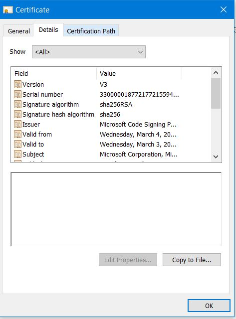
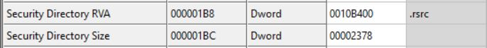
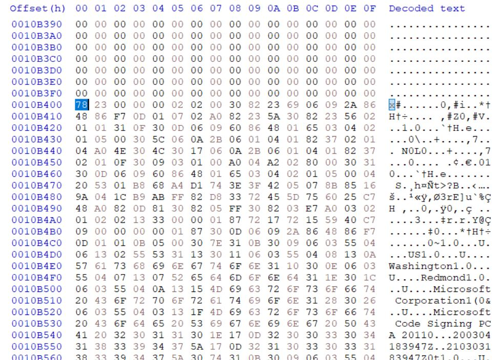

In the name of Allah

# What Do We Cover?

For a given signed PE file, with the signature embedded, we extract the signature and certificates. These are then parsed using PKCS and ASN.1 standards.

# What We Don't Cover

- PE files whose digital signatures are not embedded (reside in catalog files)
- Validating timestamp of the signatures
- Validating key usage
- Validating the chain of the certificates
- Using Windows APIs like `WinTrust` to verify signatures
- A full tutorial on ASN.1


# Tools

- CFF Explorer
- signtool
- HxD

# Links


# Table of Contents

- Parsing PE
- Parsing WIN_CERTIFICATE
- PKCS #n
- Structure of PKCS #7
- Parsing ContentInfo
- Parsing Certificates
- Parsing SignInfo
- Appendix A: PE Authenticode Hash
- Appendix B: A Brief Introduction to ASN.1


# Introduction

PE files are digitally signed to verify various aspects, such as identifying the publisher of the file and ensuring the file's integrity has not been compromised. In this write-up, we will not explain why PE files are signed, but we will delve into how they are signed and how we can verify their signatures.


## Digital Signature

We provide a sample in the *sample* directory, which contains a file named *dbgview64.exe*. We perform all verification operations on this sample PE file.

In the properties of this PE, we can view the *Digital Signatures* tab.


This tab contains almost all the information we need for verification. If we go to *Details*, the information about the signature is displayed.


You can see many *fields*—some you may understand, some you may not, and some you might misunderstand. Misunderstand!? Yes, by the end of this write-up, you'll find out!

Next, we go to the *General* tab to view the certificate that signed this PE file and the hierarchy of the certifications.


If we click on *View Certificate* and then go to the *Details* tab, we can find all the information about the signer's certificate for this PE file.



Some fields are not part of the certificate and can only be found in the GUI. Unfortunately (!), one of them is the *Thumbprint*, which is calculated every time you open this dialog. Therefore, we must calculate it manually. We discuss this later.


In the *Certification Path* tab, we can find the chain of certifications. To view the details of each certificate, you can click *View Certificate* as before.


However, for some PEs, like *C:\Windows\System32\notepad.exe*, the *Digital Signatures* tab does not exist. What does this mean? It means that Notepad is not signed!

Let's check with *signtool.exe*:

```shell
C:\>signtool.exe verify /a /v c:\Windows\System32\notepad.exe

Verifying: c:\Windows\System32\notepad.exe
File is signed in catalog: C:\WINDOWS\system32\CatRoot\{F750E6C3-38EE-11D1-85E5-00C04FC295EE}\Microsoft-Windows-Notepad-FoD-Package~31bf3856ad364e35~amd64~~10.0.19041.4355.cat
Hash of file (sha1): BC43D65CC41670FBB1E1A686AE62BFF3F9AA784A

Signing Certificate Chain:
    Issued to: Microsoft Root Certificate Authority 2010
    Issued by: Microsoft Root Certificate Authority 2010
    Expires:   Sun Jun 24 01:34:01 2035
    SHA1 hash: 3B1EFD3A66EA28B16697394703A72CA340A05BD5

        Issued to: Microsoft Windows Production PCA 2011
        Issued by: Microsoft Root Certificate Authority 2010
        Expires:   Mon Oct 19 22:21:42 2026
        SHA1 hash: 580A6F4CC4E4B669B9EBDC1B2B3E087B80D0678D

            Issued to: Microsoft Windows
            Issued by: Microsoft Windows Production PCA 2011
            Expires:   Thu Nov 14 22:50:08 2024
            SHA1 hash: 71F53A26BB1625E466727183409A30D03D7923DF

The signature is timestamped: Sat Apr 13 19:02:25 2024
Timestamp Verified by:
    Issued to: Microsoft Root Certificate Authority 2010
    Issued by: Microsoft Root Certificate Authority 2010
    Expires:   Sun Jun 24 01:34:01 2035
    SHA1 hash: 3B1EFD3A66EA28B16697394703A72CA340A05BD5

        Issued to: Microsoft Time-Stamp PCA 2010
        Issued by: Microsoft Root Certificate Authority 2010
        Expires:   Mon Sep 30 22:02:25 2030
        SHA1 hash: 36056A5662DCADECF82CC14C8B80EC5E0BCC59A6

            Issued to: Microsoft Time-Stamp Service
            Issued by: Microsoft Time-Stamp PCA 2010
            Expires:   Fri Jan 10 22:37:12 2025
            SHA1 hash: 68A0528ACCB8CBCEA997C5F2DB6089644C44DAF3

Successfully verified: c:\Windows\System32\notepad.exe

Number of files successfully Verified: 1
Number of warnings: 0
Number of errors: 0
```

The signature is verified! Which signature?

Don't be confused! Windows stores the signatures of some PE files in the *CatRoot* database (located in `C:\Windows\System32`). Many System32 PE files have their signatures residing in this database. In this write-up, we will not discuss catalog files and how to parse them. Therefore, discussing PE files whose signatures are not embedded within their files is out of our scope.

# Parsing PE

Open *dbgview64.exe* with *CFF Explorer*. In the `Optional Header`, there is a data directory named `Security Directory` (also known as the `Certification Table`).



This section shows where the embedded digital signature is located and determines its size. For our sample file, it resides at offset `0x10B400` from the beginning of the file with a size of `0x2378`.



If you look at the decoded text, you can find meaningful words like *Microsoft Corporation*, *Redmond*, *Washington*, etc. It seems we are in the right place.

How can we decode the bytes to accomplish our mission? To decode it, we must be familiar with `WIN_CERTIFICATE`.

So, it's time to get our hands dirty!

# Parsing WIN_CERTIFICATE

All the bytes in the security directory must be interpreted as a `WIN_CERTIFICATE` structure, as shown below:

```cpp
typedef struct _WIN_CERTIFICATE {
  DWORD dwLength;
  WORD  wRevision;
  WORD  wCertificateType;
  BYTE  bCertificate[ANYSIZE_ARRAY];
} WIN_CERTIFICATE, *LPWIN_CERTIFICATE;
```

 - **dwLength** (4 bytes): The length of the structure or security directory. As seen in the raw file, it is `23 78 00 00`.
 - **wRevision**: The revision number. Not important here.
 - **wCertificateType**: The certificate type we are working with is `WIN_CERT_TYPE_PKCS_SIGNED_DATA`. Therefore, we set the value of *wCertificateType* to `0x2`.
 - **bCertificate**: This is the most important field. Although the security directory may contain multiple `bCertificate` entries, we will assume there is only one for our purposes. The bCertificate field is not a specific structure itself; in digital signatures, it contains another structure named `PKCS7`.

# PKCS #n
There are multiple types of PKCS, each related to a specific function. Here is a list of PKCS types from [Wikipedia](https://en.wikipedia.org/wiki/PKCS):

- PKCS #1: RSA Cryptography Standard
- PKCS #2: *Withdrawn*
- PKCS #3: Diffie–Hellman Key Agreement Standard
- PKCS #4: *Withdrawn*
- PKCS #5: Password-based Encryption Standard
- PKCS #6: Extended-Certificate Syntax Standard
- **PKCS #7: Cryptographic Message Syntax Standard**
- PKCS #8: Private-Key Information Syntax Standard
- PKCS #9: Selected Attribute Types
- PKCS #10: Certification Request Standard
- PKCS #11: Cryptographic Token Interface
- PKCS #12: Personal Information Exchange Syntax Standard
- PKCS #13: Elliptic-curve cryptography Standard
- PKCS #14: Pseudo-random Number Generation
- PKCS #15: Cryptographic Token Information Format Standard

For digital signatures, the main focus is on PKCS #7, but we will also indirectly discuss PKCS #1, PKCS #9, and PKCS #13.

# Structure of PKCS#7

Let's return to our focus. The bCertificate field consists of a PKCS7 structure. First, we need to familiarize ourselves with its structure. Based on the [RFC](https://datatracker.ietf.org/doc/html/rfc2315#section-9.1), the signed data in PKCS7 format is defined as follows (in ASN.1 syntax):

```ASN.1
SignedData ::= SEQUENCE {
    version Version,
    digestAlgorithms DigestAlgorithmIdentifiers,
    contentInfo ContentInfo,
    certificates [0] IMPLICIT ExtendedCertificatesAndCertificates OPTIONAL,
    crls [1] IMPLICIT CertificateRevocationLists OPTIONAL,
    signerInfos SignerInfos 
}

DigestAlgorithmIdentifiers ::= SET OF DigestAlgorithmIdentifier

SignerInfos ::= SET OF SignerInfo
```

*Note: For a brief introduction to `ASN.1`, refer to the appendix.*

You can see numerous fields and their types. There are more details per field, but we will delve into some of the important fields required to continue.

## contentInfo

As you can guess, it is the info about the content that is signed.

```ASN.1
ContentInfo ::= SEQUENCE {
    contentType ContentType,
    content [0] EXPLICIT ANY DEFINED BY contentType OPTIONAL 
}

ContentType ::= OBJECT IDENTIFIER
```

## certificates

This field encompasses all certificates involved in signing the PE file (usually excluding the topmost certificate in the certificate chain).

According to [RFC](https://datatracker.ietf.org/doc/html/rfc5280#section-4.1), the basic syntax for an X.509 v3 certificate is as follows:

```ASN.1
Certificate  ::=  SEQUENCE  {
    tbsCertificate       TBSCertificate,
    signatureAlgorithm   AlgorithmIdentifier,
    signatureValue       BIT STRING  
}

TBSCertificate  ::=  SEQUENCE  {
    version         [0]  EXPLICIT Version DEFAULT v1,
    serialNumber         CertificateSerialNumber,
    signature            AlgorithmIdentifier,
    issuer               Name,
    validity             Validity,
    subject              Name,
    subjectPublicKeyInfo SubjectPublicKeyInfo,
    issuerUniqueID  [1]  IMPLICIT UniqueIdentifier OPTIONAL,
                            -- If present, version MUST be v2 or v3


    subjectUniqueID [2]  IMPLICIT UniqueIdentifier OPTIONAL,
                            -- If present, version MUST be v2 or v3
    extensions      [3]  EXPLICIT Extensions OPTIONAL
                            -- If present, version MUST be v3
}

Version  ::=  INTEGER  {  v1(0), v2(1), v3(2)  }

CertificateSerialNumber  ::=  INTEGER

UniqueIdentifier  ::=  BIT STRING

SubjectPublicKeyInfo  ::=  SEQUENCE  {
    algorithm            AlgorithmIdentifier,
    subjectPublicKey     BIT STRING  
}

AlgorithmIdentifier  ::=  SEQUENCE  {
    algorithm               OBJECT IDENTIFIER,
    parameters              ANY DEFINED BY algorithm OPTIONAL  
}
                           
```

## signerInfos

```
SignerInfo ::= SEQUENCE {
    version     Version,
    issuerAndSerialNumber   IssuerAndSerialNumber,
    digestAlgorithm     DigestAlgorithmIdentifier,
    authenticatedAttributes     [0] IMPLICIT Attributes OPTIONAL,
    digestEncryptionAlgorithm   DigestEncryptionAlgorithmIdentifier,
    encryptedDigest     EncryptedDigest,
    unauthenticatedAttributes   [1] IMPLICIT Attributes OPTIONAL 
}
```    

### Parsing issuerAndSerialNumber

### Parsing digestAlgorithm

### Parsing authenticatedAttributes

### Parsing digestEncryptionAlgorithm

### Parsing encryptedDigest

# Appendix A: PE Authenticode hash 

# Appendix B: A Brief Introduction to ASN.1

